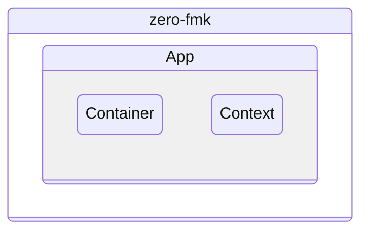
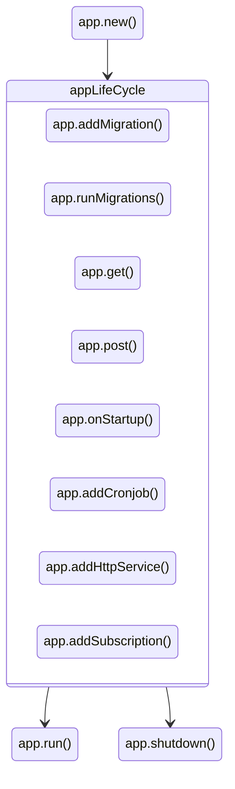
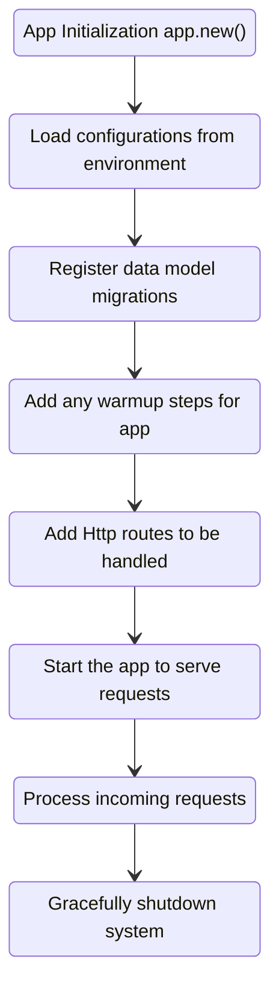

<style type="text/css">
  img-comparison-slider {
    --divider-width: 5px;
    --divider-color: #131212ff;
    --default-handle-opacity: 0.9;
  }
</style>

<script setup>
import { ImgComparisonSlider } from '@img-comparison-slider/vue';
</script>

# Architecture

`zero` follows the dependency injection pattern and allows the abstractions to be centered around with main three components.

- `App` 
- `Container`
- `Context`





## App - Orchestrator

`App` orchestractes the application life cycle, manages the framework functionality.

`App` references to all major sub-systems and provides methods to access and execute the configurations, routing, logging, registered migrations and over all 
life-cycle

`App` is the main entry point for the `zero` app.

## `App` key accessible methods



## App Lifecyle



## Methods explaination


```zig
const app = try App.new(allocator);
```

`new()` launches the zero app instance, and coordinates and creates all underlying sub-systems if the valid configurations are available.

```zig
try app.get("path", custom-handler);
```

`get()`, `post()`, `patch()`, `delete()` integrates the custom handlers to the http router and allows the resource endpoints to be responded on matched requests.

```zig
try app.addMigration(key, migrateHanlder);
```

`addMigration()` attaches the data model migrations to be executed on the application run. migrateHandler has to follow the `migrate` struct signature to execute correctly.

```zig
try app.runMigrations();
```

`runMigrations()` executes one or more migrations that has been attached in above steps, skips if the app found the migrations were already executed in it is flow.

```zig
try app.addCronJob("schedule-notation", "task-name", taskHandler);
```

`addCronJob()` comes handy to execute any repeatable jobs for the app has to perform.

```zig
try app.addSubscription(pubSubTopic, subscribeHandler);
```

`addSubscription()` allows app to subscribe to `pubsub` topic to perform needed actions.

```zig
try app.onStatup(prepareCache);
```

`onStartup` synchronize any needed actions for the app to perform before serving any requests such as warming up the cache, taking backups.

```zig
try app.addHttpService("external-service", "service-url");
```

`addHttpService()` help the developer to register any external http/https service to be associated with app life time and enables the service-to-service communications possible with minimal coding. 

```zig
try app.addWebsocket(socketHandler);
```

`addWebsocket` enables the app to upgrade and stream the bi-directional communications to the client over websockets.