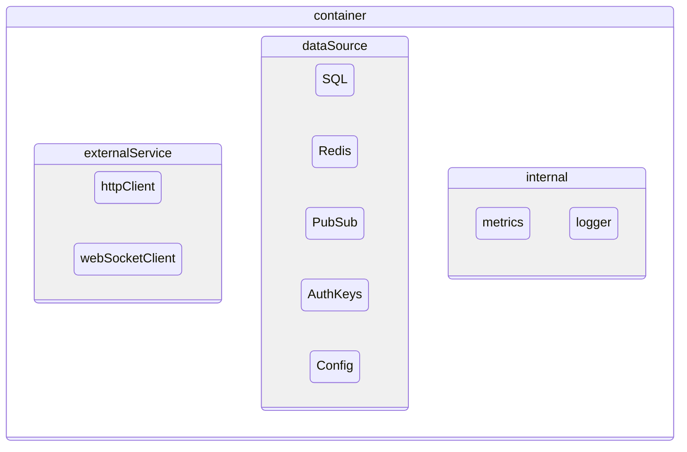
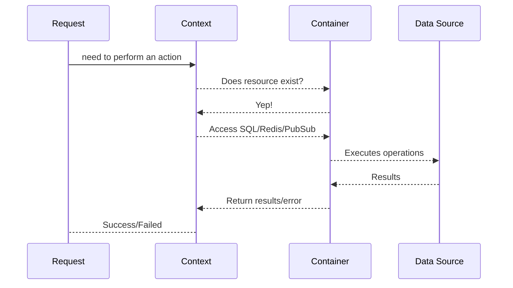

# Container

`container` are the centralized dependency injection that the app creates and holds references to all resources including configurations, authentication keys, data sources, logging, metrics and external http services.

## Overview

## Access Workflow

The `context` internally has reference to `container` through which it will access all resources and performs the needed operations as part of the incoming requests.

