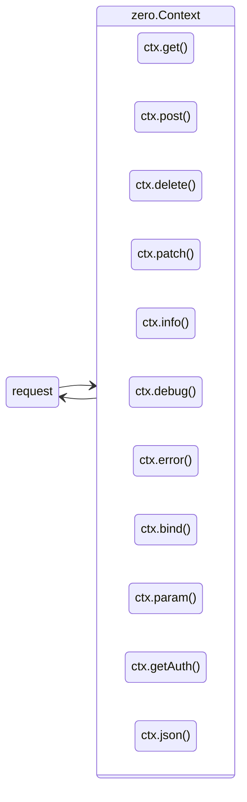
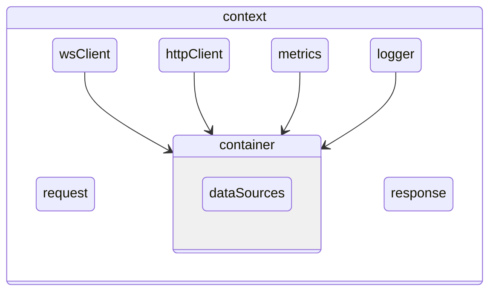
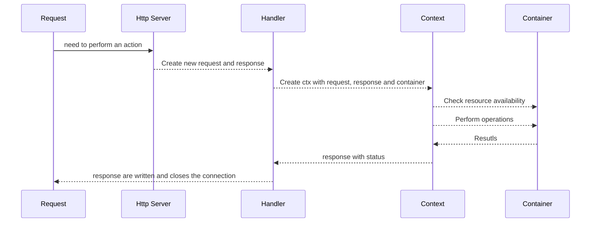

<style type="text/css">
  img-comparison-slider {
    --divider-width: 5px;
    --divider-color: #131212ff;
    --default-handle-opacity: 0.9;
  }
</style>

<script setup>
import { ImgComparisonSlider } from '@img-comparison-slider/vue';
</script>

# Context

`context` are the key feature of the `zero` app and that is the gateway to perform all needed actions for developer. Any action that need to be performed on underlying resources only available through the context.

`context` is the wrapper that references the incoming request, out-going response, container data sources, handles multiple transformations to complete the tasks.

`context` abstracts away all container access and provides convenient methods to logging, transform requests data, perform database operations, publish messages, etc.,

🚨 It is highly recommended to use the `ctx` allocator whenever possible, since it is tied up with request life-cycle, the de-allocation will be managed automatically and making sure the memory leak is not happening.

### Accessible methods



## Overview



## Access Workflow

The `context` internally has reference to `container` through which it will access all resources and performs the needed operations as part of the incoming requests.



## Methods explaination

```zig
fn customHandler(ctx *Context) !void {}
```

`ctx` instance is created on-fly and injected into the custom handler 
to perform the operations.


```zig
ctx.info("message");
```

`info()` method allow user to log something to stdout and uses the context allocator to expand the message with timestamp and logs the output.

_It is also application for `debug()`, `info()`, `err()`, `warn()`, `fatal()` as well_


```zig
ctx.bind(comptime T);
```

`bind()` comes handy when you want to transform the incoming request json data to the comptime `Type`

```zig
ctx.param("param-name");
```

`param()` allows us to retrieve the request params from the URL.

```zig
ctx.getAuthClaims();
```

`getAuthClaims()` retrieve the incoming request claims if the `authorization` token exist in place

```zig
ctx.getPublisher()
```

`getPublisher` lets you to access the pubSub client and allow to send a message to the topic.


```zig
ctx.json(data);
```

`json()` comes handy to return any zig struct as response, default response method for all developer actions.


