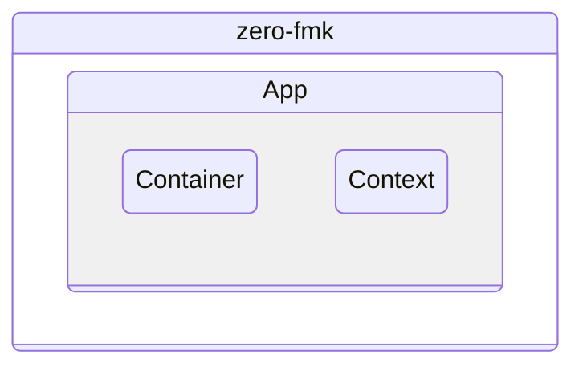
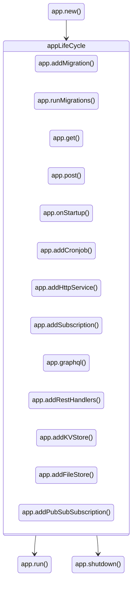
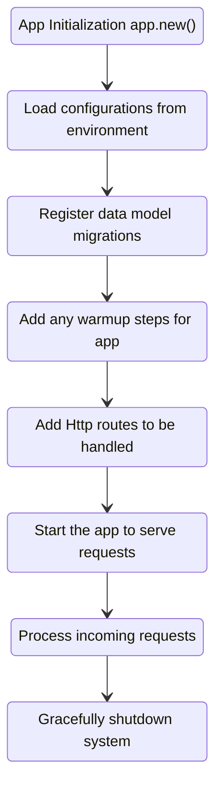

# Architecture

`zero` uses the dependency injection pattern. It centers its abstractions around three main components.

- `App` 
- `Container`
- `Context`





## App - Orchestrator

`App` orchestrates the application life cycle. It manages the framework's functionality.

`App` references all major sub-systems. It gives you methods to access and run the configuration, routing, logging, registered migrations, and the overall life-cycle.

`App` is the main entry point for the `zero` app.

## `App` key accessible methods



## App Lifecyle



## Methods explanation


```zig
// `init.environ_map` is the `*std.process.EnvMap` from `pub fn main(init: std.process.Init)`
const app = try App.new(allocator, init.io, init.environ_map);
```

`new()` launches the `zero` app instance. It sets up and creates all the underlying sub-systems when valid configuration is available.

```zig
try app.get("path", custom-handler);
```

`get()`, `post()`, `patch()`, `delete()` wire your custom handlers into the HTTP router. They let a resource endpoint respond when a request matches its path.

```zig
try app.addMigration(key, migrateHanlder);
```

`addMigration()` attaches a data model migration to run when the app starts. Your migrateHandler must follow the `migrate` struct signature to run correctly.

```zig
try app.runMigrations();
```

`runMigrations()` runs the migrations you attached in the steps above. It skips any migration it finds already ran in its flow.

```zig
try app.addCronJob("schedule-notation", "task-name", taskHandler);
```

`addCronJob()` is how you run repeatable jobs the app needs to perform on a schedule.

```zig
try app.addSubscription(pubSubTopic, subscribeHandler);
```

`addSubscription()` lets the app subscribe to a `pubsub` topic and act when messages arrive.

```zig
try app.onStatup(prepareCache);
```

`onStartup` runs any setup the app needs before serving requests. Examples are warming up the cache or taking backups.

```zig
try app.addHttpService("external-service", "service-url");
```

`addHttpService()` lets you register an external HTTP/HTTPS service for the app's lifetime. It makes service-to-service calls possible with minimal code.

```zig
try app.addWebsocket(socketHandler);
```

`addWebsocket` lets the app upgrade the connection and stream bi-directional communication to the client over websockets.

```zig
try app.graphql("/graphql", Query, Mutation, &query_root, &mutation_root);
```

`graphql()` mounts a schema-less GraphQL-over-HTTP endpoint. `Query`/`Mutation` are resolver structs; pass `null` for either root if unused.

```zig
try app.addRestHandlers(User, .{ .resource = "users" });
```

`addRestHandlers()` scaffolds list/get/create/update/delete REST handlers for a struct in one line (see [Auto CRUD](/auto-crud)).

```zig
try app.addKVStore("cache", .memory, .{});
```

`addKVStore()` registers a named [KV store](/kv-store) backend (`.redis` / `.nats_kv` / `.memory` / `.sqlite`). The first store registered (or the Redis client auto-registered on connect) becomes the default `ctx.KV`.

```zig
try app.addFileStore("uploads", .local, .{ .root = "./data/uploads" });
```

`addFileStore()` registers a named [File store](/file-store) backend (`.local` / `.ftp` / `.sftp`). The `local` backend auto-registers as the default `ctx.FileStore` when `FILE_STORE_ROOT` is set.

```zig
try app.addPubSubSubscription("subject", handler);
```

`addPubSubSubscription()` (and the broker-specific `addKafkaSubscription()` / `addNatsSubscription()`) subscribe a handler to a pub/sub topic across Kafka, MQTT and NATS (see [Using Pubsub](/pubsub)).
