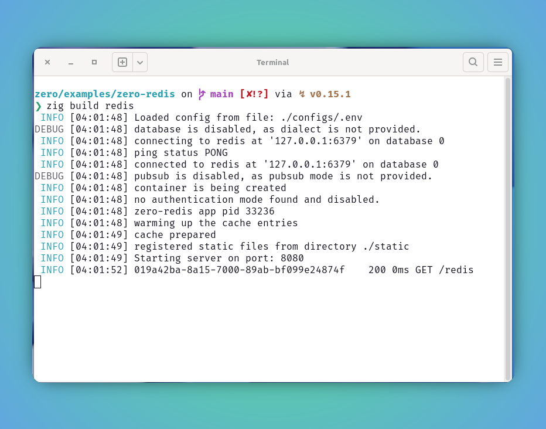
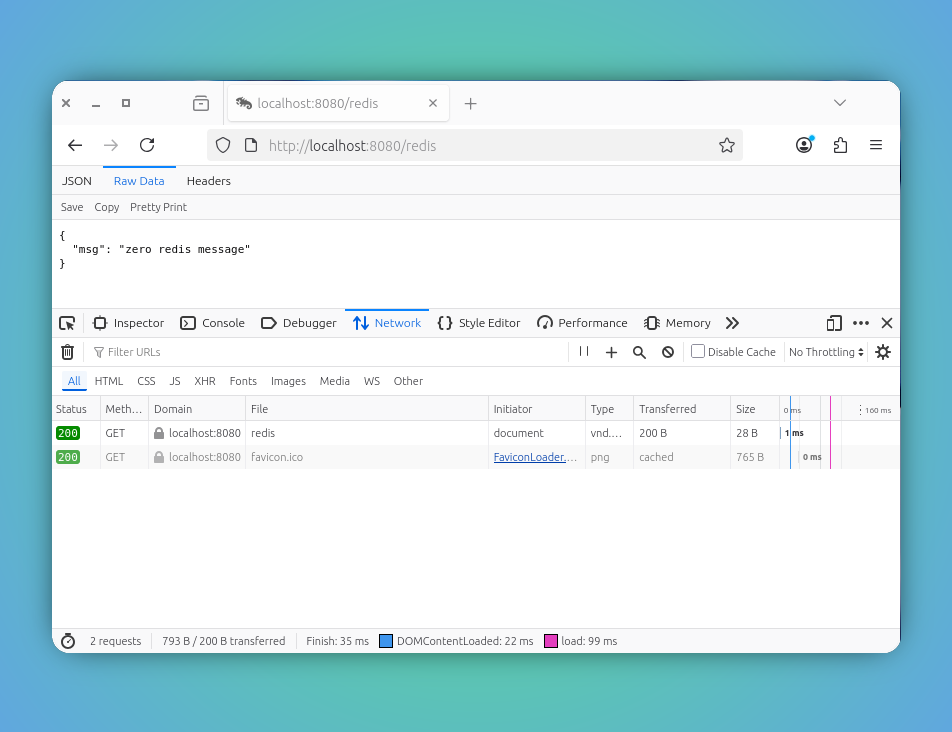

<script setup>
import { ImgComparisonSlider } from '@img-comparison-slider/vue';
</script>


# Cache

`zero` has built-in support for the accessing the redis database.

```bash
ctx.Cache.Get(); #retrieves value from cache

ctx.Cache.Set(); #persists value to cache
```

### zero-redis example

This example demonstrates the first step to spin up the basic web app using the `zero` framework. As we are going to connect to redis and retrieve in this example.

Also in this example, we are going to combine built-in solution `OnStartup`. 

The `OnStartup` helps us to warm up the redis cache with data loaded. It is not only limited to redis, but all attachable services of zero.

---

1. Pull and run podman or docker container.

::: code-group
```bash [redis container]
❯ podman pull docker.io/library/redis:alpine3.22
❯ podman run -d --name redis -p 6379:6379 redis:alpine3.22 --requirepass "password"
```
:::

2. Let us update our app configurations `configs/.env` with this.


```bash [config/.env]
# App configs
APP_NAME=zero-redis
APP_VERSION=1.0.0
APP_ENV=dev
LOG_LEVEL=debug

REDIS_HOST=127.0.0.1
REDIS_PORT=6379
REDIS_USER=redis 
REDIS_PASSWORD=password 
REDIS_DB=0
```

3. Let refer following snippet to understand the usage of the redis in zero app.

::: code-group
```zig [main.zig]
const std = @import("std");
const zero = @import("zero");

const App = zero.App;
const Context = zero.Context;
const utils = zero.utils;
const redis = zero.rediz;

pub const std_options: std.Options = .{
    .logFn = zero.logger.custom,
};

pub fn main(init: std.process.Init) !void {
    
    var arena_instance = std.heap.ArenaAllocator.init(std.heap.page_allocator);
    defer arena_instance.deinit();

    const allocator = arena_instance.allocator();

    const app = try App.new(allocator, init.io, init.environ_map);

    app.onStatup(prepareCache);

    try app.get("/redis", cacheResponse);

    try app.run();
}

fn prepareCache(ctx: *Context) !void {
    ctx.info("warming up the cache entries");

    _ = ctx.Cache.send(void, .{ "SET", "msg", "zero redis message" }) catch |err| {
        ctx.any(err);
    };

    // intentional delay to mimic cache preparation
    std.Thread.sleep(std.time.ns_per_s);

    ctx.info("cache prepared");
}

const Data = struct {
    msg: []const u8,
};

fn cacheResponse(ctx: *Context) !void {
    // const FixBuf = redis.types.FixBuf;
    const reply = try ctx.Cache.sendAlloc([]u8, ctx.allocator, .{ "GET", "msg" });
    defer ctx.allocator.free(reply);

    try ctx.json(reply);
}
```
:::

4. Boom! Lets build and run our app.

```bash
zero/examples/zero-basic on main via ↯ v0.15.1 
❯
❯ zig build redis
 INFO [04:01:48] Loaded config from file: ./configs/.env
DEBUG [04:01:48] database is disabled, as dialect is not provided.
 INFO [04:01:48] connecting to redis at '127.0.0.1:6379' on database 0
 INFO [04:01:48] ping status PONG
 INFO [04:01:48] connected to redis at '127.0.0.1:6379' on database 0
DEBUG [04:01:48] pubsub is disabled, as pubsub mode is not provided.
 INFO [04:01:48] container is being created
 INFO [04:01:48] no authentication mode found and disabled.
 INFO [04:01:48] zero-redis app pid 33236
 INFO [04:01:48] warming up the cache entries
 INFO [04:01:49] cache prepared
 INFO [04:01:49] registered static files from directory ./static
 INFO [04:01:49] Starting server on port: 8080
 INFO [04:01:52] 019a42ba-8a15-7000-89ab-bf099e24874f	 200 0ms GET /redis

```

5. Preview server status and handler response.

<ImgComparisonSlider>
<!-- eslint-disable -->


<!-- eslint-enable -->
</ImgComparisonSlider>

_Make use of this image slider to glide between status and response_

## Other cache backends (KV Store)

Beyond Redis (`ctx.Cache`), `zero` exposes a unified **KV store** that can serve as
your cache, backed by **NATS JetStream KV**, **in-memory**, or **SQLite** — so you
are not tied to a Redis dependency. Register a store at startup with
`app.addKVStore(name, backend, opts)`; the first store you register also becomes the
default, reachable from a handler via `ctx.KV` or `ctx.GetKVStore(name)`.

```zig [main.zig]
const std = @import("std");
const zero = @import("zero");

const App = zero.App;
const Context = zero.Context;
const utils = zero.utils;

pub fn main(init: std.process.Init) !void {
    var gpa: std.heap.DebugAllocator(.{}) = .init;
    const allocator = gpa.allocator();
    const app = try App.new(allocator, init.io, init.environ_map);

    // pick a backend: .redis | .nats_kv | .memory | .sqlite
    try app.addKVStore("cache", .memory, .{});                       // in-memory
    // try app.addKVStore("cache", .sqlite, .{});                    // SQLite (kv table)
    // try app.addKVStore("cache", .nats_kv, .{ .bucket = "cache" }); // NATS JetStream KV

    try app.post("/cache/:key", cacheSet);
    try app.get("/cache/:key", cacheGet);
    try app.run();
}
```

The handler API is identical across backends — `get`/`set`/`delete`/`exists`/`expire`.
Returned slices from `get` are caller-owned (free with `ctx.allocator.free`); TTLs are
set with `expire(ctx, key, ms)` (unsupported on `nats_kv`).

```zig [main.zig]
fn cacheSet(ctx: *Context) !void {
    const key = ctx.param("key");
    const kv = ctx.GetKVStore("cache") orelse return error.NoKV;
    try kv.set(ctx, key, "zero cache value");
    try ctx.json(.{ .ok = true });
}

fn cacheGet(ctx: *Context) !void {
    const key = ctx.param("key");
    const kv = ctx.GetKVStore("cache") orelse return error.NoKV;
    const v = (try kv.get(ctx, key)) orelse {
        ctx.response.setStatus(.not_found);
        return;
    };
    defer ctx.allocator.free(v);
    try ctx.json(.{ .value = v });
}
```

### Memory

The in-memory backend has zero dependencies and is handy for tests or single-instance
apps. Values live for the lifetime of the process.

```zig [main.zig]
try app.addKVStore("cache", .memory, .{});
```

### SQLite

The SQLite backend reuses the SQLite datasource and stores entries in a `kv(k, v, exp)`
table — no extra service beyond your SQLite database.

```zig [main.zig]
try app.addKVStore("cache", .sqlite, .{});
```

### NATS KV

The NATS backend reuses the `nats` dependency and requires a JetStream-enabled
connection. Set the bucket via the `bucket` option.

```zig [main.zig]
try app.addKVStore("cache", .nats_kv, .{ .bucket = "cache" });
```

See [KV Store](/kv-store) for the full reference.

## Limitations 🚨 

🚩 There will be slowness in the app and limit yourself to have 2-5 concurrent connections to serve the data from redis cache. There is a work in progress to get this mitigated.

## Recommendation

🚩 It is highly recommended to use the `ctx` allocator whenever possible, since it is tied up with request life-cycle, the de-allocation will be managed automatically and making sure the memory leak is not happening.