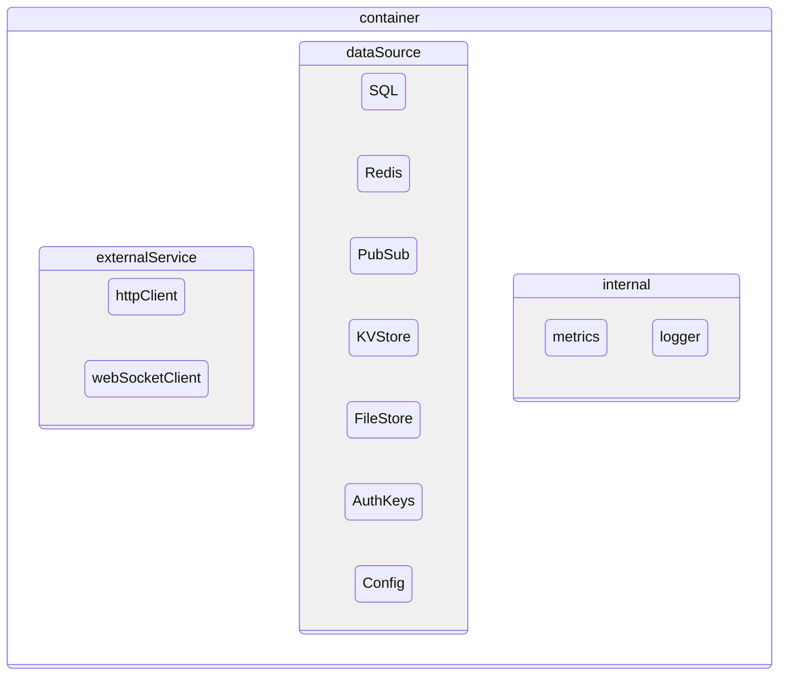

# Container

`container` are the centralized dependency injection that the app creates and holds references to all resources including configurations, authentication keys, data sources, logging, metrics and external http services.

## Overview



## Access Workflow

The `context` internally has reference to `container` through which it will access all resources and performs the needed operations as part of the incoming requests.

```mermaid
sequenceDiagram
    Request->>Context: need to perform an action
    Context-->>Container: Does resource exist?
    Container-->>Context: Yep!
    Context-->>Container: Access SQL/Redis/PubSub
    Container-->>Data Source: Executes operations
    Data Source-->>Container: Results
    Container-->>Context: Return results/error
    Context-->Request: Success/Failed

`PubSub` covers Kafka, MQTT and NATS. `KVStore` (Redis / NATS KV / memory / SQLite)
and `FileStore` (local / ftp / sftp) are the unified key-value and blob backends
registered via `app.addKVStore(...)` / `app.addFileStore(...)` (see
[KV Store](/kv-store) and [File Store](/file-store)).

## Health checks

The container aggregates component health behind two well-known endpoints:

- `GET /.well-known/health` — returns the aggregated status as JSON
  (`{ "<name>": "up" }`). If any check fails the response body reports the failing
  component as `down` and the endpoint returns a non-200 status.
- `GET /.well-known/live` — liveness probe, always returns `200` (the process is up).

Two probes are registered **automatically** when the corresponding datasource is
configured:

- `sql` — acquires and releases a pooled connection (Postgres); SQLite is reported
  healthy once loaded.
- `redis` — a `PING` round-trip.

Register your own check with `app.addHealthCheck`:

```zig [src/main.zig]
try app.addHealthCheck("my-dep", myDepCheck);

fn myDepCheck(c: *zero.container) anyerror!void {
    // return normally when healthy; any error marks the component "down"
    if (!try c.myDep.ping()) return error.Unhealthy;
}
```

The handler receives the `*container`, so it can reach any registered resource
(`c.SQL`, `c.kv`, `c.pubsub`, …) to validate it.
