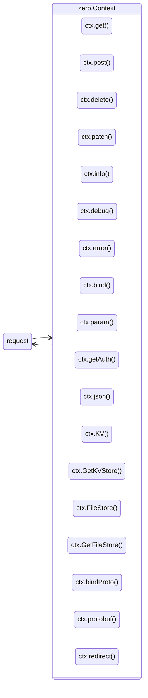
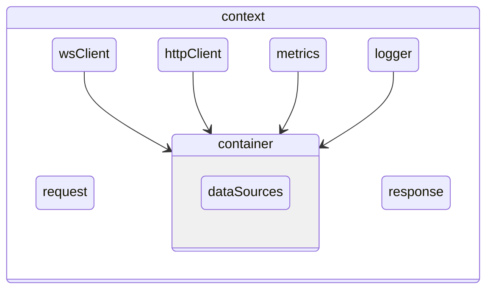
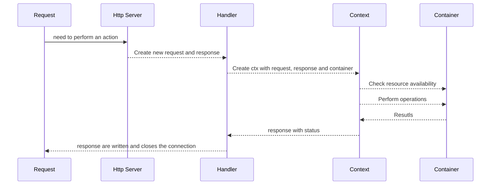

# Context

The `context` is the key feature of the `zero` app. It's the gateway for everything you do as a developer. Any action on the underlying resources is only available through the context.

The `context` wraps the incoming request, the outgoing response, and the container's data sources. It handles the transformations needed to complete each task.

The `context` hides container access behind convenient methods. You can log, transform request data, run database operations, publish messages, and more.

It is highly recommended to use the `ctx` allocator whenever you can. It's tied to the request life-cycle, so de-allocation is managed for you. That prevents memory leaks.

### Accessible methods



## Overview



## Access Workflow

Internally, the `context` holds a reference to the `container`. It uses that reference to reach every resource and run the operations a request needs.



## Methods explanation

```zig
fn customHandler(ctx *Context) !void {}
```

A `ctx` instance is created on the fly and injected into your custom handler so you can perform operations on it.


```zig
ctx.info("message");
```

The `info()` method logs a message to stdout. It uses the context allocator to add a timestamp, then writes the output.

_This also applies to `debug()`, `err()`, `warn()`, and `fatal()`._


```zig
ctx.bind(comptime T);
```

`bind()` is handy when you want to transform the incoming JSON request body into a comptime `Type`.

```zig
ctx.param("param-name");
```

`param()` lets you read request parameters from the URL.

```zig
ctx.getAuthClaims();
```

`getAuthClaims()` returns the request's claims when an `authorization` token is present.

```zig
ctx.getPublisher()
```

`getPublisher` gives you access to the pub/sub client so you can publish a message to a topic.


```zig
ctx.json(data);
```

`json()` returns any Zig struct as the response. It's the default method for your handler actions.

```zig
const kv = ctx.KV orelse ctx.GetKVStore("sessions") orelse return error.NoKV;
try kv.set(ctx, "user:1", "active");
```

`KV` is the default [KV store](/kv-store) (Redis when configured, or the first store registered with `app.addKVStore`). `GetKVStore(name)` looks up a named store. Both expose `get`/`set`/`delete`/`exists`/`expire`.

```zig
const data = (try ctx.GetFileFromStore("uploads", name)) orelse return error.NotFound;
try ctx.SaveFileToStore("uploads", name, bytes);
```

`FileStore` is the default [File store](/file-store); `GetFileStore(name)` looks up a named store. `GetFile(field)` reads a `multipart/form-data` upload, `SaveFileToStore` persists it, and `GetFileFromStore` / `File(path)` serve it back.

```zig
const req = (try ctx.bindProto(pb.Echo)) orelse return error.BadRequest;
try ctx.protobuf(out);
```

`bindProto(T)` decodes an `application/x-protobuf` request body into `T`; `protobuf(data)` serializes `data` back with `Content-Type: application/x-protobuf` (see [Protobuf](/protobuf)).

```zig
ctx.redirect("/login");
ctx.redirectWith(std.http.Status.moved_permanently, "https://example.com/new");
```

`redirect()` issues a `302` redirect; `redirectWith(status, url)` issues an explicit status (see [Rate Limiter & Request Helpers](/rate-limiter)).

The [PubSub](/pubsub) client is reachable through `ctx.pubsub` (and `ctx.NATS` / `ctx.Kakfa` / `ctx.MQ` for broker-specific access); the inbound message arrives on `ctx.message`.
