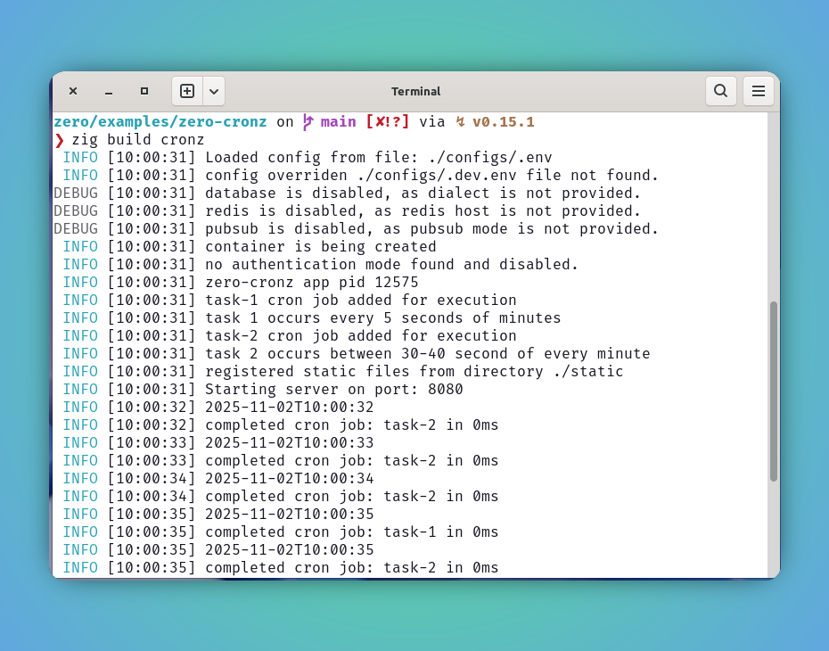

# Scheduling Tasks

`zero` allows one can schedule one or more mundane tasks to complete any app specific tasks for developer.

`zero` follows `crontab` notation to provide a clear and concise understanding of task repetition and even to the level of `seconds`

```bash
second(s) minute(s) hours(s) dayOfMonth(s) month(s) dayOfWeek(s)
    *       *          *          *           *         *
```

### Cronz 

`zero` has a built-in solution called `cronz` let you schedule one or more tasks that leverage underlying container to achieve something useful in the app life-time.

This built-in support offers a straightforward invocation and allows developers to easily define and manage their scheduling needs.

::: code-group
```zig [method signature]
app.addCronJob("cron-schedule", "task-name", task-handler);
```

```zig [task handler]
fn task1(ctx: *Context) !void {
    # your needed tasks executed here
}
```
:::

### Supported Crontab notations

| Format                  | What it does?                                  | Mode   |
| ----------------------- | ---------------------------------------------- | ------ |
| \* \* \* \* \* \*       | Execute on every second                        |        |
| 1-10 \* \* \* \* \*     | Execute between 1-10 seconds of each minute    | Range  |
| \*/2 \* \* \*      | Execute on every two minutes                   | Split  |
| 0 1,3,5,10 \* \* \* \* | Execute on every 1st, 3rd, 5th and 10th Minute | Repeat |


### Example

This document demonstrates the scheduling of tasks using the `zero` built-in solution called `cronz`.


1. Refer following `zero-cronz` example further to know more on getting started of this.

::: code-group
```zig [main.zig]
const std = @import("std");
const zero = @import("zero");

const App = zero.App;
const Context = zero.Context;
const utils = zero.utils;

pub const std_options: std.Options = .{
    .logFn = zero.logger.custom,
};

pub fn main() !void {
    var arena_instance = std.heap.ArenaAllocator.init(std.heap.page_allocator);
    defer arena_instance.deinit();

    const allocator = arena_instance.allocator();

    const app = try App.new(allocator);

    try app.addCronJob("*/5 * * * * *", "task-1", task1);
    app.container.log.info("task 1 occurs every 5 seconds of minutes");

    try app.addCronJob("[30-40] * * * * *", "task-2", task2);
    app.container.log.info("task 2 occurs between 30-40 second of every minute");

    try app.run();
}

fn task1(ctx: *Context) !void {
    const timestamp = try utils.sqlTimestampz(ctx.allocator);
    ctx.info(timestamp);
}

fn task2(ctx: *Context) !void {
    const timestamp = try utils.sqlTimestampz(ctx.allocator);
    ctx.info(timestamp);
}
```
:::

2. Boom! lets build and run our app.

```bash
zero/examples/zero-cronz on  main [✘!?] via ↯ v0.15.1 
❯ zig build cronz
 INFO [10:11:16] Loaded config from file: ./configs/.env
 INFO [10:11:16] config overriden ./configs/.dev.env file not found.
DEBUG [10:11:16] database is disabled, as dialect is not provided.
DEBUG [10:11:16] redis is disabled, as redis host is not provided.
DEBUG [10:11:16] pubsub is disabled, as pubsub mode is not provided.
 INFO [10:11:16] container is being created
 INFO [10:11:16] no authentication mode found and disabled.
 INFO [10:11:16] zero-cronz app pid 13506
 INFO [10:11:16] task-1 cron job added for execution
 INFO [10:11:16] task 1 occurs every 5 seconds of minutes
 INFO [10:11:16] task-2 cron job added for execution
 INFO [10:11:16] task 2 occurs between 30-40 second of every minute
 INFO [10:11:16] registered static files from directory ./static
 INFO [10:11:16] Starting server on port: 8080
 INFO [10:11:20] 2025-11-02T10:11:20
 INFO [10:11:20] completed cron job: task-1 in 0ms
 INFO [10:11:25] 2025-11-02T10:11:25
 INFO [10:11:25] completed cron job: task-1 in 0ms
 INFO [10:11:30] 2025-11-02T10:11:30
 INFO [10:11:30] completed cron job: task-1 in 0ms
 INFO [10:11:30] 2025-11-02T10:11:30
 INFO [10:11:30] completed cron job: task-2 in 0ms
```

3. Preview server status and job repetitions.



## Recommendation

🚩 It is highly recommended to use the `ctx` allocator whenever possible, since it is tied up with request life-cycle, the de-allocation will be managed automatically and making sure the memory leak is not happening.