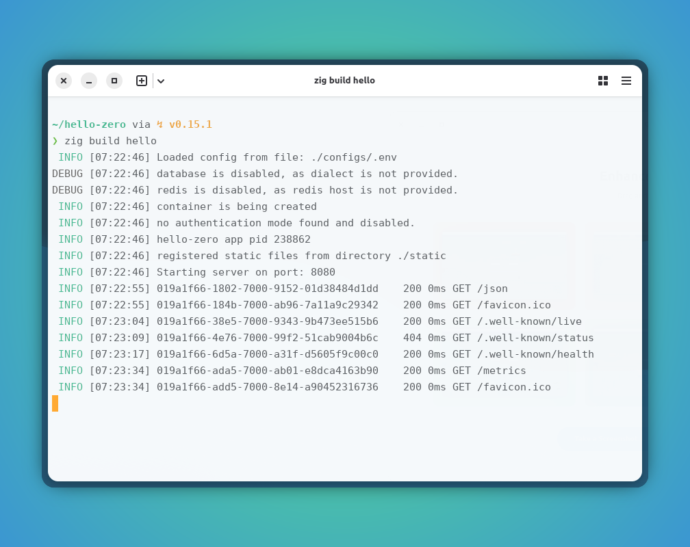
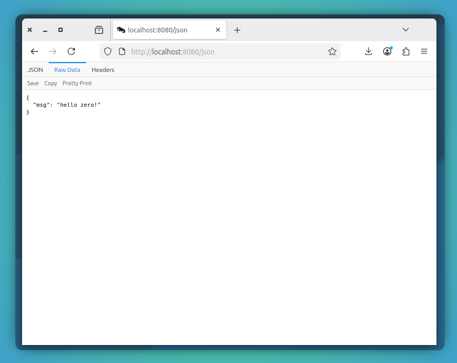

<style type="text/css">
  img-comparison-slider {
    --divider-width: 5px;
    --divider-color: #131212ff;
    --default-handle-opacity: 0.9;
  }
</style>

<script setup>
import { ImgComparisonSlider } from '@img-comparison-slider/vue';
</script>

# Hello Zero!
This document outlines the step to get started with `hello world` using the `zero` framework.

Lets begin...

0. Create an empty folder with `zig init`

::: code-group

```bash [Create new folder]
❯ mkdir hello-zero && cd hello-zero
❯ zig init
info: created build.zig
info: created build.zig.zon
info: created src/main.zig
info: created src/root.zig
info: see `zig build --help` for a menu of options
❯ 
❯ zig fetch --save https://github.com/im-ng/zero/archive/refs/heads/main.zip
❯ 
```
:::

1. Update app dependency to load `zero` fmk as module

::: code-group

```zig [build.zig]
const std = @import("std");

pub fn build(b: *std.Build) void {
    const target = b.standardTargetOptions(.{});
    const optimize = b.standardOptimizeOption(.{});

    const zero = b.dependency("zero", .{});

    const exe = b.addExecutable(.{
        .name = "hello",
        .root_module = b.createModule(.{
            .root_source_file = b.path("src/main.zig"),
            .target = target,
            .optimize = optimize,
        }),
    });

    exe.root_module.addImport("zero", zero.module("zero"));

    b.installArtifact(exe);

    const run_cmd = b.addRunArtifact(exe);
    run_cmd.step.dependOn(b.getInstallStep());
    if (b.args) |args| {
        run_cmd.addArgs(args);
    }

    const run_step = b.step("hello", "Run hello server");
    run_step.dependOn(&run_cmd.step);
}
```

```zig [build.zig.zon]
.{
    .name = .hello_zero,
    .version = "0.0.0",
    .fingerprint = 0x3567b067feb9ecb1,
    .minimum_zig_version = "0.15.1",
    .dependencies = .{
        .asciigraph = .{
            .url = "https://github.com/im-ng/zero/archive/refs/heads/main.zip",
            .hash = "zero-0.0.1-W787cAhaAABPJQ30gkLvzn_hlUDZtR-7qAtq8jDqmoyH", // once released the hash will change.
        },
    },
    .paths = .{
        "build.zig",
        "build.zig.zon",
        "src",
    },
}
```

:::

2. Update app configrations in `configs/.env` to serve our hello world.

::: code-group

```bash [Create env file]
cd hello-zero
mkdir configs
touch configs/.env
```

```bash [Add configs]
APP_ENV=dev
APP_NAME=hello-zero
APP_VERSION=1.0.0
LOG_LEVEL=debug
```

:::

3. Copy your app favorite icon to serve from first request.

::: code-group

```bash [Copy favicon.ico]
cd hello-zero
mkdir static
cp <your-favorite-icon> static/
```

:::

4. Start writing your zero web app to serve first request

::: code-group

```zig [src/main.zig]
const std = @import("std");
const zero = @import("zero");

const App = zero.App;
const Context = zero.Context;

// we may need to add this `std_options` 
// on the main fn file for tidy logs.
pub const std_options: std.Options = .{
    .logFn = zero.logger.custom,
};

pub fn main() !void {
    var arena_instance = std.heap.ArenaAllocator.init(std.heap.page_allocator);
    defer arena_instance.deinit();

    const allocator = arena_instance.allocator();

    // create zero App
    // internally zero loads container with configured services attached
    const app: *App = try App.new(allocator);

    // register our first route on app
    try app.get("/json", jsonResponse);

    // start the server by invoking run
    try app.run();
}

// Context comes handy with all zero dependencies
fn jsonResponse(ctx: *Context) !void {
    ctx.info("inside the json handler");

    try ctx.json(.{ .msg = "hello zero!" });
}
```

:::

5. Finally build and serve your new web app

<ImgComparisonSlider>
<!-- eslint-disable -->


<!-- eslint-enable -->
</ImgComparisonSlider>

6. Start and graceful shutdown of server

::: code-group
```bash [Start server]
❯ zig build hello
 INFO [07:22:46] Loaded config from file: ./configs/.env
DEBUG [07:22:46] database is disabled, as dialect is not provided.
DEBUG [07:22:46] redis is disabled, as redis host is not provided.
 INFO [07:22:46] container is being created
 INFO [07:22:46] no authentication mode found and disabled.
 INFO [07:22:46] hello-zero app pid 238862
 INFO [07:22:46] registered static files from directory ./static
 INFO [07:22:46] Starting server on port: 8080
 INFO [07:22:55] 019a1f66-1802-7000-9152-01d38484d1dd    200 0ms GET /json
 INFO [07:22:55] 019a1f66-184b-7000-ab96-7a11a9c29342    200 0ms GET /favicon.ico
 INFO [07:23:04] 019a1f66-38e5-7000-9343-9b473ee515b6    200 0ms GET /.well-known/live
 INFO [07:23:09] 019a1f66-4e76-7000-99f2-51cab9004b6c    404 0ms GET /.well-known/status
 INFO [07:23:17] 019a1f66-6d5a-7000-a31f-d5605f9c00c0    200 0ms GET /.well-known/health
 INFO [07:23:34] 019a1f66-ada5-7000-ab01-e8dca4163b90    200 0ms GET /metrics
 INFO [07:23:34] 019a1f66-add5-7000-8e14-a90452316736    200 0ms GET /favicon.ico
 INFO [07:40:16] 019a1f75-fa36-7000-8e7b-2512ab2e9596    200 0ms GET /json
```
```bash [Shutdown server] 
# Interrupt signal (Ctrl+C) will exit the server gracefully without any leaks

INFO [07:49:45] 019a1f7e-a71f-7000-a0d5-1ce39e5e5b0c    200 0ms GET /json
^C

~/hello-zero via ↯ v0.15.1 took 34m22s
❯  INFO [07:57:06] server shutting down
received shutdown signal

~/hello-zero via ↯ v0.15.1
❯
```
:::

7. `hello-zero` directory structure for reference

::: code-group
```bash [directory structure]
~/hello-zero via ↯ v0.15.1
❯ tree -a
.
├── build.zig
├── build.zig.zon
├── configs
│   └── .env
├── src
│   ├── main.zig
│   └── root.zig
└── static
    └── favicon.ico

4 directories, 6 files
```
:::

## Recommendation

🚩 It is highly recommended to use the `ctx` allocator whenever possible, since it is tied up with request life-cycle, the de-allocation will be managed automatically and making sure the memory leak is not happening.