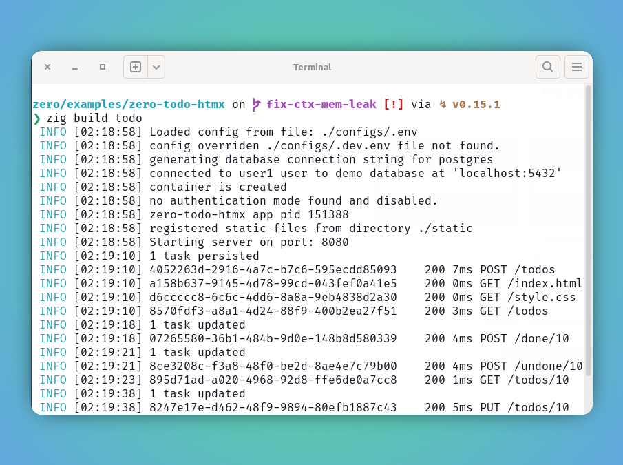
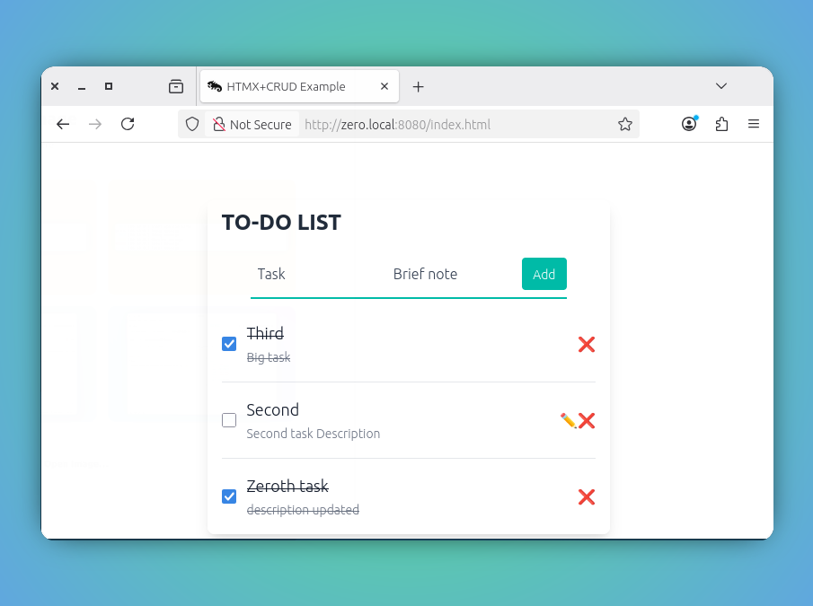

<style type="text/css">
  img-comparison-slider {
    --divider-width: 5px;
    --divider-color: #131212ff;
    --default-handle-opacity: 0.9;
  }
</style>

<script setup>
import { ImgComparisonSlider } from '@img-comparison-slider/vue';
</script>


# CRUD

`zero` framework offers support to manage the RESTful endpoints with custom handlers that allow us to combine with built-in services, and let us to manage `Create, Read, Update and Delete` operations with ease.


::: code-group
```zig [crud methods]
try app.get("/todos", handler.getAll);

try app.get("/todos/:id", handler.getTodo);

try app.post("/todos", handler.persistTodo);

try app.put("/todos/:id", handler.updateTodo);

try app.delete("/todos/:id", handler.deleteTodo);
```
:::


### Example

Refer the `zero-htmx-todo` example to understand further on using the CRUD operations fully.

This example includes a working prototype of the frontend using htmx, helps us to perform the operations of the to-do tasks

Operations such as:

- Add one or more `todo` tasks using `POST` method
- Update `task` and `description` of the tasks using `PUT` method
- Preview one or more tasks using `GET` method
- Mark `task`s are done with `POST` method
- Delete if you don't want to keep them around using `DELETE` method

The `htmx` frontend is available in the `static` directory and will be automatically served from `:8080/index.html`

As we are dealing with `CRUD` operations, this example uses the `demo` database to persist, retrieve and update the underlying data. 

Please refer to `config/.env` for more. The app automatically runs the migrations and make the tables available for our `CRUD` operations.

::: code-group
```zig [main.zig]
const std = @import("std");
const zero = @import("zero");

const models = @import("models.zig");
const migrations = @import("migrations/all.zig");
const handler = @import("handler.zig");

const App = zero.App;
const Context = zero.Context;
const migrate = zero.migrate;
const container = zero.container;
const utils = zero.utils;
const dateTime = zero.zdt.Datetime;

pub const std_options: std.Options = .{
    .logFn = zero.logger.custom,
};

pub fn main() !void {
    var arean = std.heap.ArenaAllocator.init(
        std.heap.page_allocator,
    );
    defer arean.deinit();

    const allocator = arean.allocator();

    const app = try App.new(allocator);

    try migrations.all(app);

    try app.runMigrations();

    try app.get("/todos", handler.getAll);

    try app.get("/todos/:id", handler.getTodo);

    try app.post("/todos", handler.persistTodo);

    try app.put("/todos/:id", handler.updateTodo);

    try app.delete("/todos/:id", handler.deleteTodo);

    try app.post("/done/:id", handler.markDone);

    try app.post("/undone/:id", handler.markUndone);

    try app.run();
}
```
```bash [config/.env]
APP_ENV=dev
APP_NAME=zero-todo-htmx
APP_VERSION=1.0.0
LOG_LEVEL=info

DB_HOST=localhost
DB_USER=user1
DB_PASSWORD=password1
DB_NAME=demo
DB_PORT=5432
DB_DIALECT=postgres
```
_Check out the example entire code to understand the usage better_
:::

2. Let us break down and see how the `custom` handlers are performing the `CRUD` operations.

::: code-group
```zig [get method]
pub fn getAll(ctx: *Context) !void {
    var rows = try ctx.SQL.queryRows(models.getAllTodos, .{});
    defer rows.deinit();

    var responses = std.array_list.Managed(
        models.HandlerTodo,
    ).init(
        ctx.allocator,
    );

    while (try rows.next()) |row| {
        const todo = try row.to(models.Todo, .{});

        const response = models.HandlerTodo{
            .id = try std.fmt.allocPrint(ctx.allocator, "{d}", .{todo.id.?}),
            .description = todo.description,
            .task = todo.task,
            .isDone = todo.isDone,
            .created_at = try utils.DTtimestampz(
                ctx.allocator,
                todo.created_at,
            ),
        };

        try responses.append(response);
    }

    const list = try helper.itemList(ctx, responses);

    ctx.response.content_type = .HTML;
    ctx.response.setStatus(.ok);
    ctx.response.body = list;
}
```
```zig [post method]
pub fn persistTodo(ctx: *Context) !void {
    var t: models.Todo = undefined;

    if (try ctx.bind(models.Todo)) |todo| {
        t = todo;
    }

    // persist todo entry in database
    const id = try ctx.SQL.exec(models.addTodoEntry, .{ t.task, t.description });

    if (id) |_id| {
        const status = try utils.toStringFromInt(
            ctx.allocator,
            "{d} task persisted",
            _id,
        );
        ctx.info(status);
    }

    var row = try ctx.SQL.queryRow(
        models.getTodoEntry,
        .{},
    ) orelse unreachable;
    defer row.deinit() catch {};

    const res = try row.to(models.Todo, .{});

    var response = models.HandlerTodo{
        .id = try std.fmt.allocPrint(
            ctx.allocator,
            "{d}",
            .{res.id.?},
        ),
        .description = res.description,
        .task = res.task,
        .isDone = res.isDone,
    };
    response.created_at = try utils.DTtimestampz(
        ctx.allocator,
        res.created_at,
    );

    ctx.response.setStatus(.ok);
    ctx.response.header("HX-Refresh", "true");
}
```
```zig [put method]
pub fn updateTodo(ctx: *Context) !void {
    const todoID = ctx.param("id");

    const t = try ctx.bind(models.Todo);

    // persist todo entry in database
    const id = try ctx.SQL.exec(
        models.updateTodo,
        .{ t.?.task.?, t.?.description.?, todoID },
    );

    if (id) |_id| {
        const status = try utils.toStringFromInt(
            ctx.allocator,
            "{d} task updated",
            _id,
        );
        ctx.info(status);
    }

    var row = try ctx.SQL.queryRow(
        models.getTodoByID,
        .{todoID},
    ) orelse unreachable;
    defer row.deinit() catch {};

    const res = try row.to(models.Todo, .{});

    var response = models.HandlerTodo{
        .id = try std.fmt.allocPrint(
            ctx.allocator,
            "{d}",
            .{res.id.?},
        ),
        .description = res.description,
        .task = res.task,
        .isDone = res.isDone,
    };
    response.created_at = try utils.DTtimestampz(
        ctx.allocator,
        res.created_at,
    );

    var sb = Builder.init(ctx.allocator);
    try helper.innerHtmlItem(ctx.allocator, &sb, &response);
    ctx.response.content_type = .HTML;
    ctx.response.setStatus(.ok);
    ctx.response.body = sb.string();
}
```
```zig [delete method]
pub fn deleteTodo(ctx: *Context) !void {
    const id = ctx.param("id");
    ctx.info(id);

    const row = ctx.SQL.queryRow(
        models.getTodoByID,
        .{id},
    ) catch |err| {
        ctx.response.setStatus(.internal_server_error);
        ctx.err("something went wrong!");
        ctx.any(err);
        return;
    };

    if (row == null) {
        const msg = try utils.toString(
            ctx.allocator,
            "No valid data found for id: {s}",
            id,
        );
        ctx.info(msg);

        ctx.response.setStatus(.not_found);
        ctx.response.header("HX-Refresh", "true");
        return;
    }

    _ = try ctx.SQL.exec(models.deleteTodo, .{id});

    ctx.response.setStatus(.ok);
    ctx.response.header("HX-Refresh", "true");
}
```
:::

3. Boom! lets build and run our app.


```bash
zero/examples/zero-todo-htmx on  main [!] via ↯ v0.15.1 
❯ zig build todo
 INFO [02:18:58] Loaded config from file: ./configs/.env
 INFO [02:18:58] config overriden ./configs/.dev.env file not found.
 INFO [02:18:58] generating database connection string for postgres
 INFO [02:18:58] connected to user1 user to demo database at 'localhost:5432'
 INFO [02:18:58] container is created
 INFO [02:18:58] no authentication mode found and disabled.
 INFO [02:18:58] zero-todo-htmx app pid 151388
 INFO [02:18:58] registered static files from directory ./static
 INFO [02:18:58] Starting server on port: 8080
 INFO [02:19:10] 1 task persisted
 INFO [02:19:10] 4052263d-2916-4a7c-b7c6-595ecdd85093	 200 7ms POST /todos
 INFO [02:19:10] a158b637-9145-4d78-99cd-043fef0a41e5	 200 0ms GET /index.html
 INFO [02:19:10] d6ccccc8-6c6c-4dd6-8a8a-9eb4838d2a30	 200 0ms GET /style.css
 INFO [02:19:10] 8570fdf3-a8a1-4d24-88f9-400b2ea27f51	 200 3ms GET /todos
 INFO [02:19:18] 1 task updated
 INFO [02:19:18] 07265580-36b1-484b-9d0e-148b8d580339	 200 4ms POST /done/10
 INFO [02:19:21] 1 task updated
 INFO [02:19:21] 8ce3208c-f3a8-48f0-be2d-8ae4e7c79b00	 200 4ms POST /undone/10
 INFO [02:19:23] 895d71ad-a020-4968-92d8-ffe6de0a7cc8	 200 1ms GET /todos/10
 INFO [02:19:38] 1 task updated
 INFO [02:19:38] 8247e17e-d462-48f9-9894-80efb1887c43	 200 5ms PUT /todos/10
 INFO [02:19:42] 1 task updated
 INFO [02:19:42] ef17eead-2410-4d77-afce-3d5ce58d33a8	 200 3ms POST /done/10
```

3. Preview server status of the `CRUD` operations.

<ImgComparisonSlider>
<!-- eslint-disable -->


<!-- eslint-enable -->
</ImgComparisonSlider>

## Recommendation

🚩 It is highly recommended to use the `ctx` allocator whenever possible, since it is tied up with request life-cycle, the de-allocation will be managed automatically and making sure the memory leak is not happening.