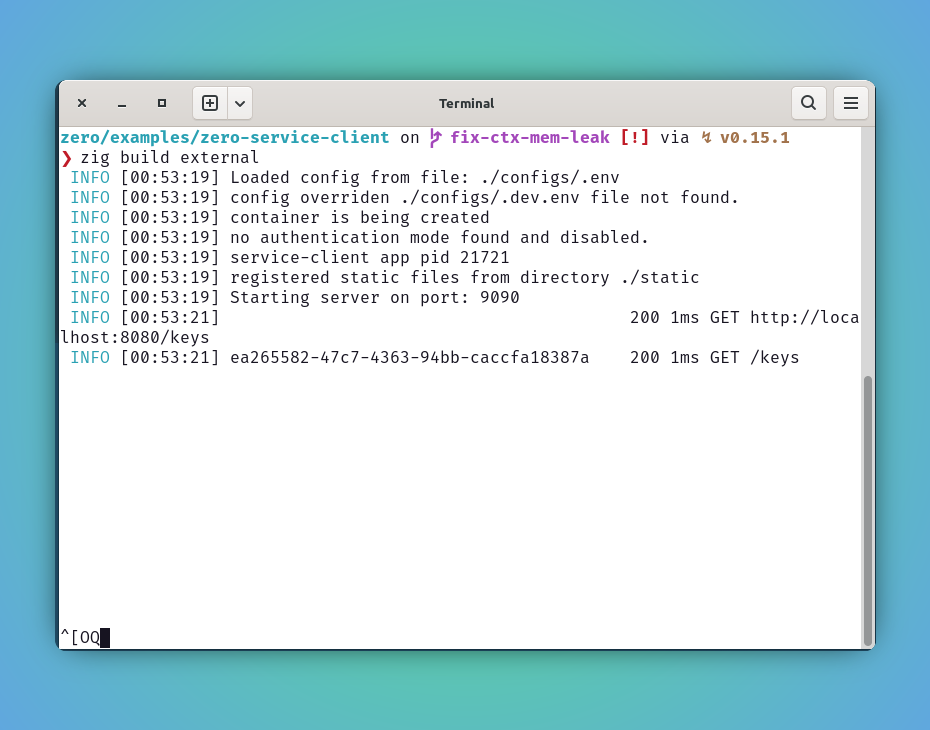
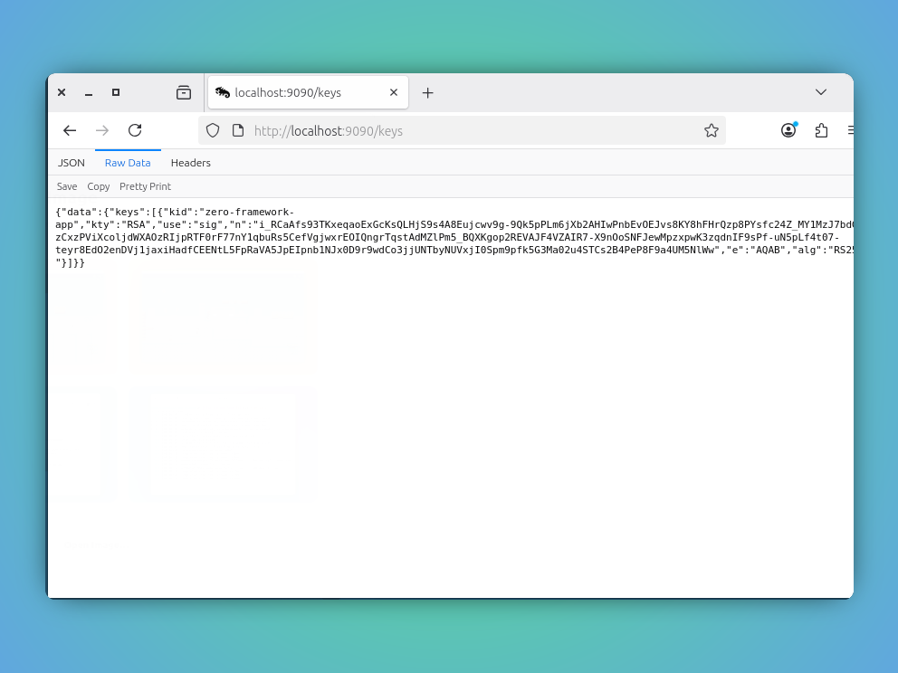

<style type="text/css">
  img-comparison-slider {
    --divider-width: 5px;
    --divider-color: #131212ff;
    --default-handle-opacity: 0.9;
  }
</style>

<script setup>
import { ImgComparisonSlider } from '@img-comparison-slider/vue';
</script>

# Http Service

As we are leveraging the microservice architecture, the web application meant to serve others requests and also request other services as well.

With that in mind, `zero` framework has built-in solution to register and communicate to external services as they do like database calls.

## What is supported?

- Inter service http calls (GET,POST,PATCH,DELETE)
- Log and trace all outgoing calls
- Health checks

## Usage

`zero` comes with handy `addHttpService` method to register a http client and registered
client will be available through `context`

Prefer to use the unique service names to distinguish clients in the `zero` app life-time.

```zig
app.addHttpService("service-name", "http://service-base-url");

// if you prefer to load the URL from configs
app.addHttpService("service-name", app.config.Get("SERVICE_URL"));
```

## Example

1. Refer following [`zero-service-client`](https://github.com/im-ng/zero/examples/zero-service-client) example further to know more on getting started of this. 

::: code-group

```zig [main.zig]
const std = @import("std");
const zero = @import("zero");

const App = zero.App;
const Context = zero.Context;
const utils = zero.utils;
const ClientError = zero.Error.ClientError;

pub const std_options: std.Options = .{
    .logFn = zero.logger.custom,
};

pub const publicKey = struct {
    kid: []const u8,
    kty: []const u8,
    use: []const u8,
    n: []const u8,
    e: []const u8,
    alg: []const u8,
};

pub const publicKeys = struct {
    keys: []publicKey,
};

pub fn main() !void {
    var arean = std.heap.ArenaAllocator.init(std.heap.page_allocator);
    defer arean.deinit();

    const allocator = arean.allocator();

    const app = try App.new(allocator);

    try app.addHttpService("auth-service", app.config.Get("SERVICE_URL"));

    try app.get("/status", serviceStatus);

    try app.run();
}

fn serviceStatus(ctx: *Context) !void {
    const service = ctx.getService("auth-service");

    if (service) |authSvc| {
        const response = try authSvc.Get(ctx, publicKeys, "/keys", null, null);
        try ctx.json(response);
    }
}
```

```bash [config/.env]
APP_ENV=dev
APP_NAME=service-client
APP_VERSION=1.0.0
LOG_LEVEL=info

HTTP_PORT=9090
SERVICE_URL="http://localhost:8080"
```
:::

2. Boom! lets build and run our app.

```bash
❯ zig build external
 INFO [00:53:19] Loaded config from file: ./configs/.env
 INFO [00:53:19] config overriden ./configs/.dev.env file not found.
 INFO [00:53:19] container is being created
 INFO [00:53:19] no authentication mode found and disabled.
 INFO [00:53:19] service-client app pid 21721
 INFO [00:53:19] registered static files from directory ./static
 INFO [00:53:19] Starting server on port: 9090
 INFO [00:53:21]                                     	 200 1ms GET http://localhost:8080/keys
 INFO [00:53:21] ea265582-47c7-4363-94bb-caccfa18387a	 200 1ms GET /keys

```

3. Preview server status and capture `auth-service` public keys.

_Assuming you are already running `zero-basic` app on http port `8080` to serve us the request_

<ImgComparisonSlider>
<!-- eslint-disable -->


<!-- eslint-enable -->
</ImgComparisonSlider>

## Limitations 🚨 

🚩 We encounter memory leaks when we try to access the external service URL with https and compression enabled. There is a work in progress to get this mitigated.