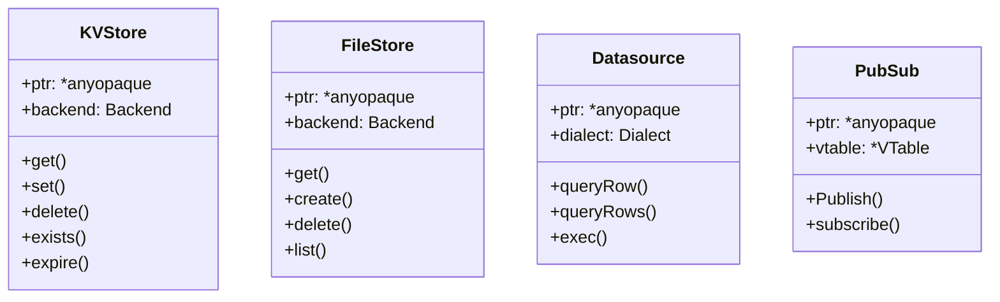

# Interface

`zero` talks to many interchangeable backends - Redis, NATS KV, in-memory and
SQLite for key-value; local/ftp/sftp for files; Postgres/SQLite for SQL; and
Kafka/MQTT/NATS for pub/sub.

To keep handler code backend-agnostic, each of these is exposed through
a **type-erased interface**: a stable, uniform API backed by a
concrete implementation that the caller never names.

There are two shapes in the framework:

- **Enum-tagged** — a `*anyopaque` pointer plus a `Backend`/`Dialect` enum; each
  method `switch`es on the tag and casts the pointer to the concrete type. Used by
  `KVStore`, `FileStore` and `Datasource`.

- **VTable (fat pointer)** — a `*anyopaque` pointer plus a `*const VTable` of
  function pointers. Used by `PubSub`.



## Enum-tagged interface — `KVStore`

The handle stores the opaque pointer and the backend tag. `init` wraps any concrete
`*T`; every method re-casts `ptr` to the right type based on `backend`.

```zig
pub const KVStore = struct {
    ptr: *anyopaque,
    backend: Backend,

    pub fn init(ptr: anytype, backend: Backend) KVStore {
        return .{ .ptr = @ptrCast(@alignCast(ptr)), .backend = backend };
    }

    pub fn get(self: *KVStore, ctx: *Context, key: []const u8) !?[]const u8 {
        return switch (self.backend) {
            .redis => @as(*redis.KVRedis, @ptrCast(@alignCast(self.ptr))).get(ctx, key),
            .nats_kv => @as(*natskv.KVNats, @ptrCast(@alignCast(self.ptr))).get(ctx, key),
            .memory => @as(*memory.KVMemory, @ptrCast(@alignCast(self.ptr))).get(ctx, key),
            .sqlite => @as(*sqlite.KVSQLite, @ptrCast(@alignCast(self.ptr))).get(ctx, key),
        };
    }
    // set / delete / exists / expire follow the same switch + cast pattern
};
```

`KVStore.build(container, backend, opts)` constructs the concrete backend from the
container's configured connections (e.g. it reads `container.redis` for `.redis`, or
`container.Nats.?.js` for `.nats_kv`) and wraps it.

The wrapped handle is stored in `container.kvStores`; the first one registered
or the Redis client auto-registered on connect — becomes the default `ctx.KV`.

`FileStore` (backends `local` / `ftp` / `sftp`) and `Datasource` (dialects
`postgres` / `sqlite`) use the identical pattern.

## VTable interface — `PubSub`

Instead of a tag, the handle carries a table of function pointers. Each backend
(MQTT, Kafka, NATS) supplies a `VTable`; `Publish`/`subscribe` forward to it after
casting `ptr` back to the concrete client.

```zig
pub const Interface = struct {
    ptr: *anyopaque,
    vtable: *const VTable,

    pub const VTable = struct {
        publish: *const fn (*anyopaque, []const u8, []const u8) anyerror!void,
        subscribe: *const fn (*anyopaque, []const u8, *const fn (*Context) anyerror!void) anyerror!void,
    };

    pub fn Publish(self: Interface, subject: []const u8, payload: []const u8) !void {
        return self.vtable.publish(self.ptr, subject, payload);
    }

    pub fn subscribe(self: Interface, subject: []const u8, hook: *const fn (*Context) anyerror!void) !void {
        return self.vtable.subscribe(self.ptr, subject, hook);
    }
};
```

## Unified inbound message

Subscribe hooks receive a backend-agnostic message via a tagged union:

```zig
pub const Message = union(enum) {
    mqtt: *root.mqMessage,
    kafka: *root.kafkaMessage,
    nats: *root.natsMessage,
};
```

In a handler the active field is selected by the connected backend:

```zig
fn onMessage(ctx: *Context) !void {
    if (ctx.message) |message| {
        const m = message.nats; // .mqtt / .kafka / .nats depending on backend
        ctx.info(m.payload);
    }
}
```

## Why it matters

Because the concrete type is erased, handler code only ever touches `ctx.KV`,
`ctx.FileStore`, `ctx.SQL` and `ctx.pubsub`.

Swapping a backend — Redis → NATS KV, or Postgres → SQLite
is a configuration change (`PUBSUB_BACKEND`, `DB_DIALECT`, `app.addKVStore(...)`),
not a code change.

See [KV Store](/kv-store), [File Store](/file-store), [Using Pubsub](/pubsub) and
[Using Postgres](/rest-handler) for the public-facing APIs built on these
interfaces.
