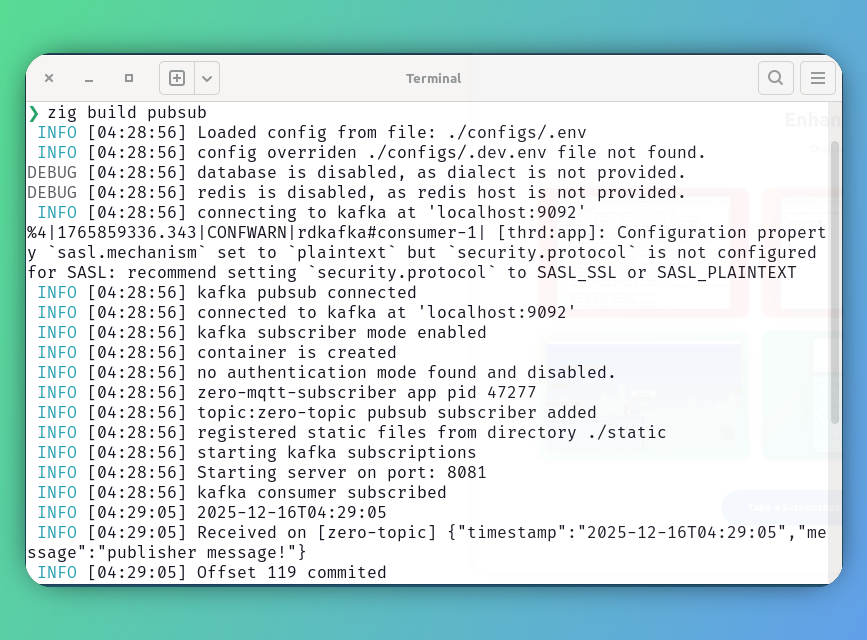
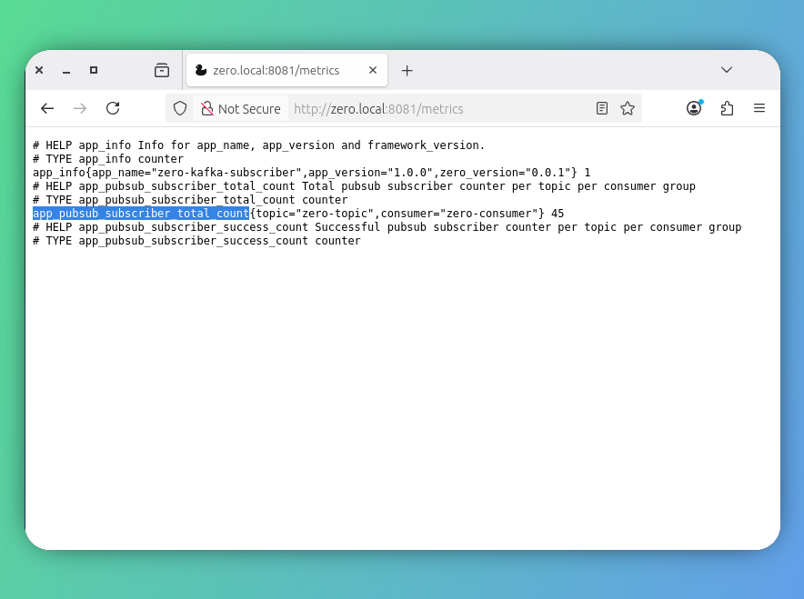

<style type="text/css">
  img-comparison-slider {
    --divider-width: 5px;
    --divider-color: #131212ff;
    --default-handle-opacity: 0.9;
  }
</style>

<script setup>
import { ImgComparisonSlider } from '@img-comparison-slider/vue';
</script>

# Kafka Subscriber

This document demonstrates the kafka subscriber capability to a topic using `zero` built-in solution 
`KF` client.

It is continuation of the [Publisher](./kafka-publisher) to preview the subscriber demo. Prefer to read that first.


```zig [kafka]
app.addKafkaSubscription("topic", subscriberHandler); #listens for upcoming event and injects into subscriber handler for further actions.
```

## Interim solution

🚩 Zero framework comes with Kafka support through `librdkafka` C Library linking. Since we don't have a pure Zig 
Kafka client, we are leveraging the use of this C implementations, achieving the message queue capability. 

🚩 Unlike other driver support, we need to `install` librdkafka separately in your Linux container or in developer machine
to make use of this. I am sorry for these limitations but pleased to make use of `zig` inter-operability to achieve Kafka 
publishing without any shortcomings.

## Recommendation

It is highly recommended to install the `librdkafka` library in developer / container machine.

::: code-group
```bash [debian]
apt install librdkafka-dev
```

```bash [macOS]
brew install librdkafka
```
:::

## Example

1. Refer following `zero-kafka-subscriber` example further to know more on getting started of this.

2. Spin up kafka container locally to subscriber to published topic messages

```bash
podman pull docker.io/apache/kafka:4.1.1
```

_We have enabled the kafka support for all security mechanism, and have been tested with `SASL` and `PLAIN` format alone_

::: code-group
```bash [SASL_PLAINTEXT]
podman run -d -it --name kafkaserver \
-p 9092-9093:9092-9093  \
-e KAFKA_NODE_ID=1 \
-e KAFKA_PROCESS_ROLES=broker,controller \
-e KAFKA_LISTENERS=SASL_PLAINTEXT://:9092,CONTROLLER://localhost:9093 \
-e KAFKA_SECURITY_INTER_BROKER_PROTOCOL=SASL_PLAINTEXT \
-e KAFKA_ADVERTISED_LISTENERS=SASL_PLAINTEXT://localhost:9092 \
-e KAFKA_LISTENER_SECURITY_PROTOCOL_MAP=CONTROLLER:PLAINTEXT,SASL_PLAINTEXT:SASL_PLAINTEXT \
-e KAFKA_CONTROLLER_QUORUM_VOTERS=1@localhost:9093 \
-e KAFKA_SASL_MECHANISM_INTER_BROKER_PROTOCOL=PLAIN \
-e KAFKA_SASL_ENABLED_MECHANISMS=PLAIN \
-e KAFKA_CONTROLLER_LISTENER_NAMES=CONTROLLER \
-e KAFKA_OPTS="-Djava.security.auth.login.config=/etc/kafka/kafka_server_jaas.conf" \
-v "./configs/kafka_server_jaas.conf:/etc/kafka/kafka_server_jaas.conf"   \
docker.io/apache/kafka:4.1.1
```

```bash [PLAIN]
podman run -d -it --name kafkaserver \
-p 9092-9093:9092-9093  \
-e KAFKA_NODE_ID=1 \
-e KAFKA_PROCESS_ROLES=broker,controller \
-e KAFKA_LISTENERS=PLAINTEXT://:9092,CONTROLLER://:9093 \
-e KAFKA_ADVERTISED_LISTENERS=PLAINTEXT://127.0.0.1:9092 \
-e KAFKA_LISTENER_SECURITY_PROTOCOL_MAP=CONTROLLER:PLAINTEXT,PLAINTEXT:PLAINTEXT \
-e KAFKA_CONTROLLER_QUORUM_VOTERS=1@127.0.0.1:9093 \
-e KAFKA_CONTROLLER_LISTENER_NAMES=CONTROLLER \
-e KAFKA_OFFSETS_TOPIC_REPLICATION_FACTOR=1   \
-e KAFKA_TRANSACTION_STATE_LOG_REPLICATION_FACTOR=1 \
-e KAFKA_TRANSACTION_STATE_LOG_MIN_ISR=1 \
-e ALLOW_PLAINTEXT_LISTENER=yes \
-v kafka_server:/kafkaserver   \
docker.io/apache/kafka:4.1.1
```
:::

Prefer to check out `jaas` config provided in the `configs` folder for `SASL` mechanism.

::: code-group
```bash
KafkaServer {
   org.apache.kafka.common.security.plain.PlainLoginModule required
   username="admin"
   password="secret"
   user_admin="secret";
};
```
:::

3. Let us attach needed configurations to connect with our `kafkaserver` cluster.

::: code-group
```bash [config/.env]
#PLAIN mechanism
APP_NAME=zero-mqtt-subscriber
APP_VERSION=1.0.0
APP_ENV=dev
LOG_LEVEL=debug
HTTP_PORT=8081

PUBSUB_BACKEND=KAFKA
PUBSUB_BROKER="localhost:9092"
CONSUMER_ID="zero-consumer"
KAFKA_BATCH_SIZE=1000
KAFKA_BATCH_BYTES=1048576
KAFKA_BATCH_TIMEOUT=300
KAFKA_SASL_MECHANISM=PLAINTEXT
```

```bash [config/.env]
#SASL mechanism
APP_NAME=zero-mqtt-subscriber
APP_VERSION=1.0.0
APP_ENV=dev
LOG_LEVEL=debug
HTTP_PORT=8081

PUBSUB_BACKEND=KAFKA
PUBSUB_BROKER="localhost:9092"
CONSUMER_ID="zero-consumer"
KAFKA_BATCH_SIZE=1000
KAFKA_BATCH_BYTES=1048576
KAFKA_BATCH_TIMEOUT=300
KAFKA_SECURITY_PROTOCOL=SASL_PLAINTEXT
KAFKA_SASL_MECHANISM=PLAIN
KAFKA_SASL_USERNAME=admin
KAFKA_SASL_PASSWORD=secret
```
:::

4. Add basic subscriber to receive messages from `zero-topic`

::: code-group

```zig [main.zig]
const std = @import("std");
const zero = @import("zero");

const App = zero.App;
const Context = zero.Context;
const utils = zero.utils;

pub const std_options: std.Options = .{
    .logFn = zero.logger.custom,
};

const topicName = "zero-topic";

pub fn main() !void {
    var gpa: std.heap.GeneralPurposeAllocator(.{}) = .init;
    const allocator = gpa.allocator();
    _ = gpa.detectLeaks();

    const app: *App = try App.new(allocator);

    try app.addKafkaSubscription(topicName, subscribeTask);

    try app.run();
}

const customMessage = struct {
    msg: []const u8 = undefined,
    topic: []const u8 = undefined,
};

fn subscribeTask(ctx: *Context) !void {
    ctx.info("msg");
    const timestamp = try utils.sqlTimestampz(ctx.allocator);
    //transform ctx.message to custom type in packet read itself
    if (ctx.message2) |message| {
        var buffer: []u8 = undefined;
        buffer = try ctx.allocator.alloc(u8, 1024);
        buffer = try std.fmt.bufPrint(buffer, "Received on [{s}] {s}", .{ message.topic, message.payload.? });

        ctx.info(timestamp);
        ctx.info(buffer);
    }
}
```
:::

5. Boom! lets build and run our app.

::: code-group
```bash
❯ zig build pubsub
 INFO [04:31:37] Loaded config from file: ./configs/.env
 INFO [04:31:37] config overriden ./configs/.dev.env file not found.
DEBUG [04:31:37] database is disabled, as dialect is not provided.
DEBUG [04:31:37] redis is disabled, as redis host is not provided.
 INFO [04:31:37] connecting to kafka at 'localhost:9092'
 INFO [04:31:37] kafka pubsub connected
 INFO [04:31:37] connected to kafka at 'localhost:9092'
 INFO [04:31:37] kafka subscriber mode enabled
 INFO [04:31:37] container is created
 INFO [04:31:37] no authentication mode found and disabled.
 INFO [04:31:37] zero-mqtt-subscriber app pid 50511
 INFO [04:31:37] topic:zero-topic pubsub subscriber added
 INFO [04:31:37] registered static files from directory ./static
 INFO [04:31:37] starting kafka subscriptions
 INFO [04:31:37] Starting server on port: 8081
 INFO [04:31:38] kafka consumer subscribed
 INFO [04:31:45] 2025-12-16T04:31:45
 INFO [04:31:45] Received on [zero-topic] {"timestamp":"2025-12-16T04:31:45","message":"publisher message!"}
 INFO [04:31:45] Offset 123 commited
 INFO [04:31:46] 2025-12-16T04:31:46
 INFO [04:31:46] Received on [zero-topic] {"timestamp":"2025-12-16T04:31:46","message":"publisher message!"}
 INFO [04:31:46] Offset 124 commited
 INFO [04:31:47] 2025-12-16T04:31:47
 INFO [04:31:47] Received on [zero-topic] {"timestamp":"2025-12-16T04:31:47","message":"publisher message!"}
 INFO [04:31:47] Offset 125 commited
 INFO [04:31:48] 2025-12-16T04:31:48
 INFO [04:31:48] Received on [zero-topic] {"timestamp":"2025-12-16T04:31:48","message":"publisher message!"}
 INFO [04:31:48] Offset 126 commited
```
:::

3. Preview publisher status of the our application.

<ImgComparisonSlider>


</ImgComparisonSlider>

4. `zero` comes with subscriber metrics handy to preview success/failed counts.



## Issues

Zig build will fail if the above dependency is not installed properly.

```bash
❯ zig build pubsub
pubsub
└─ run exe pubsub
   └─ compile exe pubsub Debug native failure
error: error: unable to find dynamic system library 'rdkafka' using strategy 'paths_first'. searched paths:
  /usr/local/lib/librdkafka.so
  /usr/local/lib/librdkafka.a
```
