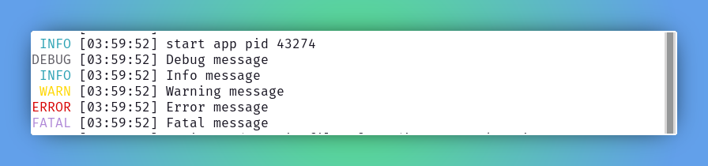

# Logging

`zero` handles logging in well strucutred manner to provide ongoing state of the application and services that it attached to.

The logs are tidy and visualque to understand the app status.

The framework allows to customize and know only the needed information on any given time.

Through `LOG_LEVEL` config one can adjust the app logging and know more of underlying state. The least level is `debug` and that let start see logs all above.

Levels in order (highest to lowest) - `fatal`, `error`, `warn`, `info` and `debug`.

## Remote log level

`LOG_LEVEL` can also be driven at runtime from a remote endpoint. When
`REMOTE_LOG_URL` is configured, `zero` registers an outbound HTTP client and a
cron job that fetches the level (JSON `{ "level": "info" }`) every
`REMOTE_LOG_FETCH_INTERVAL` seconds (default 15) and applies it in-process. The
feature is opt-in — leave `REMOTE_LOG_URL` empty to disable it. See
[Configuration → Remote Log](./configuration.md#remote-log) for the keys.

When `zero` app runs, it starts reading log level, allow us to know more 
* log level of statement
* database/kv/mq connection status
* authentication setup
* static directory attachments, 
* request trace id, response status, response handling time 
* possibly errors that occured.

## Visual cue





## Method signature

```zig [With in ctx handler]
ctx.info("message");

ctx.debug([]const u8);

ctx.err([]const u8);

ctx.warn([]const u8);

ctx.fatal([]const u8);

ctx.any(struct);
```