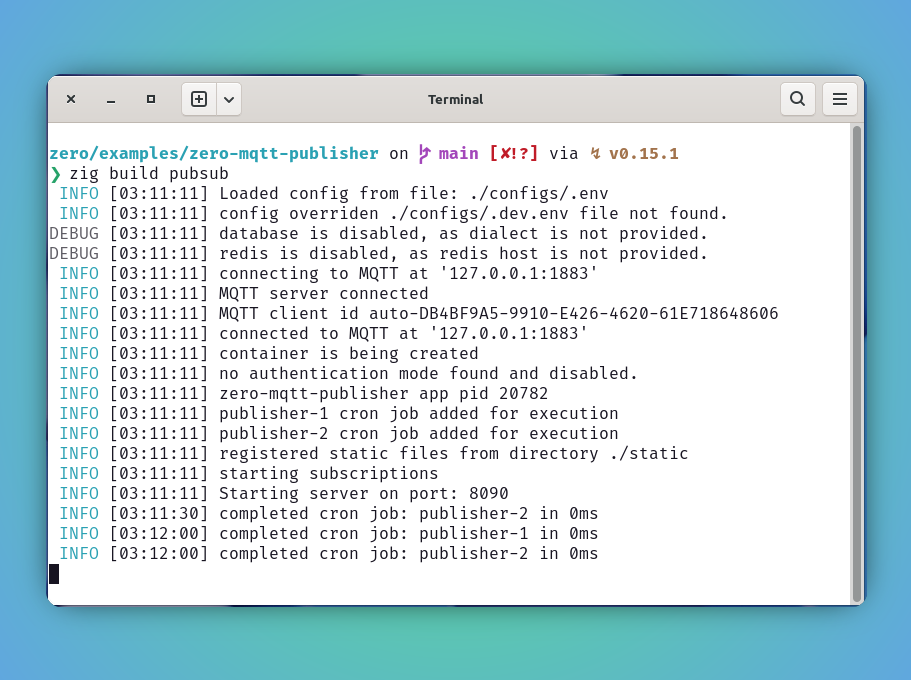
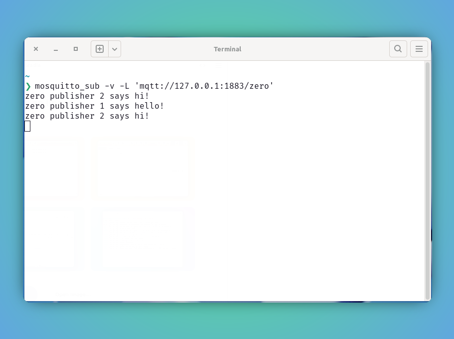

<style type="text/css">
  img-comparison-slider {
    --divider-width: 5px;
    --divider-color: #131212ff;
    --default-handle-opacity: 0.9;
  }
</style>

<script setup>
import { ImgComparisonSlider } from '@img-comparison-slider/vue';
</script>

# MQTT Publisher

This document demonstrates the publishing to a topic using `zero` built-in solution `MQ` client.

1. Refer following `zero-mqtt-publisher` example further to know more on getting started of this.

Create following mosquitto.conf file to kick start our MQTT server

```bash
❯ mkdir -p config
❯ touch config/mosquitto.conf
❯ more config/mosquitto.conf
allow_anonymous true
listener 1883 0.0.0.0
socket_domain ipv4
persistence true
persistence_file mosquitto.db
persistence_location /mosquitto/data/
```

Pull and run podman or docker container.

```
❯ podman pull docker.io/library/eclipse-mosquitto
❯ podman run -it -d --name mqtt -p1883:1883 -v "$PWD/config:/mosquitto/config" eclipse-mosquitto
```

::: code-group

```zig [main.zig]
const std = @import("std");
const zero = @import("zero");

const Allocator = std.mem.Allocator;
const App = zero.App;
const Context = zero.Context;
const utils = zero.utils;

pub const std_options: std.Options = .{
    .logFn = zero.logger.custom,
};

const pubSubTopic = "zero";

pub fn main() !void {
    var arena_instance = std.heap.ArenaAllocator.init(std.heap.page_allocator);
    defer arena_instance.deinit();

    const allocator: Allocator = arena_instance.allocator();

    const app: *App = try App.new(allocator);

    try app.addCronJob("0 * * * * *", "publisher-1", publishTask1);

    try app.addCronJob("*/30 * * * * *", "publisher-2", publishTask2);

    try app.run();
}

fn publishTask1(ctx: *Context) !void {
    const timestamp = try utils.sqlTimestampz(ctx.allocator);
    const id = try ctx.MQ.Publish("zero", "publisher 1 says hello!");

    if (id) |_id| {
        var buffer: []u8 = undefined;
        buffer = try ctx.allocator.alloc(u8, 100);
        buffer = try std.fmt.bufPrint(buffer, "Message {d} published", .{_id});
        defer ctx.allocator.free(buffer);

        ctx.info(timestamp);
    }
}

fn publishTask2(ctx: *Context) !void {
    const timestamp = try utils.sqlTimestampz(ctx.allocator);
    const id = try ctx.MQ.Publish("zero", "publisher 2 says hi!");

    if (id) |_id| {
        var buffer: []u8 = undefined;
        buffer = try ctx.allocator.alloc(u8, 100);
        buffer = try std.fmt.bufPrint(buffer, "Message {d} published", .{_id});
        defer ctx.allocator.free(buffer);

        ctx.info(timestamp);
    }
}

```

:::

2. Boom! lets build and run our app.

```bash
zero/examples/zero-mqtt-publisher on  main [✘!?] via ↯ v0.15.1
❯ zig build pubsub
 INFO [03:11:11] Loaded config from file: ./configs/.env
 INFO [03:11:11] config overriden ./configs/.dev.env file not found.
DEBUG [03:11:11] database is disabled, as dialect is not provided.
DEBUG [03:11:11] redis is disabled, as redis host is not provided.
 INFO [03:11:11] connecting to MQTT at '127.0.0.1:1883'
 INFO [03:11:11] MQTT server connected
 INFO [03:11:11] MQTT client id auto-DB4BF9A5-9910-E426-4620-61E718648606
 INFO [03:11:11] connected to MQTT at '127.0.0.1:1883'
 INFO [03:11:11] container is being created
 INFO [03:11:11] no authentication mode found and disabled.
 INFO [03:11:11] zero-mqtt-publisher app pid 20782
 INFO [03:11:11] publisher-1 cron job added for execution
 INFO [03:11:11] publisher-2 cron job added for execution
 INFO [03:11:11] registered static files from directory ./static
 INFO [03:11:11] starting subscriptions
 INFO [03:11:11] Starting server on port: 8090
 INFO [03:11:30] completed cron job: publisher-2 in 0ms
 INFO [03:12:00] completed cron job: publisher-1 in 0ms
 INFO [03:12:00] completed cron job: publisher-2 in 0ms
```

3. Preview server status and publish status.

<ImgComparisonSlider>
<!-- eslint-disable -->


<!-- eslint-enable -->
</ImgComparisonSlider>

_In next demo we will replace the `mosquitto_client` with `zero` subscriber to listen to topic and capture the events._

## Recommendation

🚩 It is highly recommended to use the `ctx` allocator whenever possible, since it is tied up with request life-cycle, the de-allocation will be managed automatically and making sure the memory leak is not happening.
