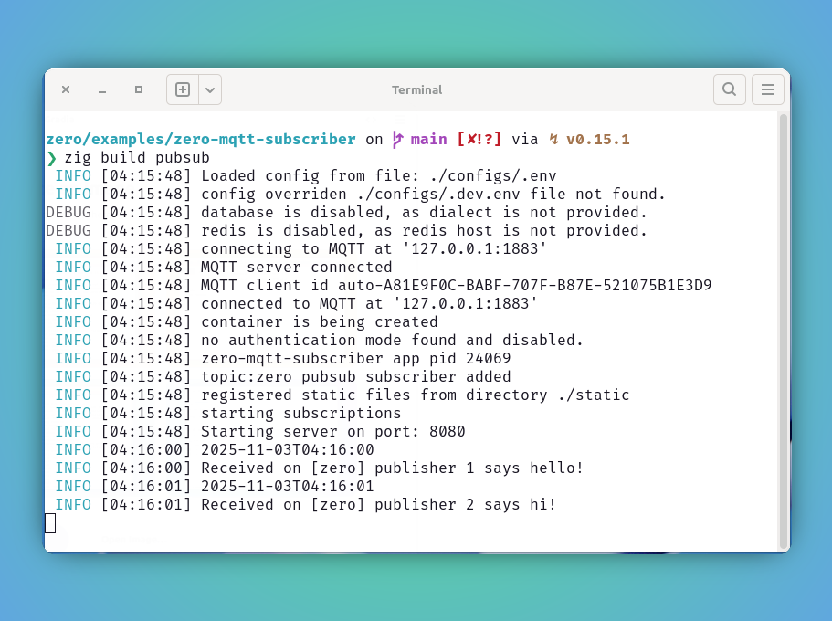
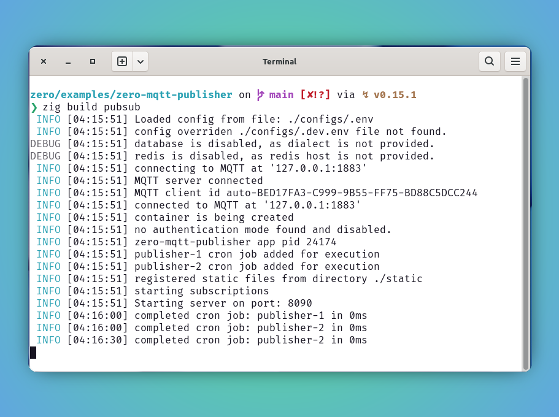

<style type="text/css">
  img-comparison-slider {
    --divider-width: 5px;
    --divider-color: #131212ff;
    --default-handle-opacity: 0.9;
  }
</style>

<script setup>
import { ImgComparisonSlider } from '@img-comparison-slider/vue';
</script>


# PubSub

This document is continuation of the [Publisher](./message-queue-publisher) to preview the subscriber demo. Prefer to read that first.

The `MQ` client will be automatically added to `container` once the needed service configurations available.

```bash
ctx.MQ.publish("topic"); #publishes message to a topic on the subscribed client

app.addSubscription("topic", subscriber-handler); #listens for upcoming event and injects into subscriber handler for further actions.
```

### Support

`zero` framework supports following brokers to publish and subscriber to.

| Message Broker                  | Support |
| ----------------------- | ---------------------------------------------- | 
| MQTT | ✅ |
| Kafka | In progress |

### Limitations

- Upto 32KB size of message supported by default.
- Subscribes to only one topic now, work in progress to make it available for multiple `topics` without any change from app developers.

### Example

This document demonstrates the subscribing to a topic using `zero` built-in solution `MQ` client.


1. Refer following `zero-mqtt-subscriber` example further to know more on getting started of this.

::: code-group
```zig [main.zig]
const std = @import("std");
const zero = @import("zero");

const App = zero.App;
const Context = zero.Context;
const utils = zero.utils;

pub const std_options: std.Options = .{
    .logFn = zero.logger.custom,
};

const pubSubTopic = "zero";

pub fn main() !void {
    var arena_instance = std.heap.ArenaAllocator.init(std.heap.page_allocator);
    defer arena_instance.deinit();

    const allocator = arena_instance.allocator();

    const app = try App.new(allocator);

    try app.addSubscription(pubSubTopic, subscribeTask);

    // prefer only one topic for now
    // second one will not be captured
    // try app.addSubscription("second", subscribeTask);

    try app.run();
}

const customMessage = struct {
    msg: []const u8 = undefined,
    topic: []const u8 = undefined,
};

fn subscribeTask(ctx: *Context) !void {
    const timestamp = try utils.sqlTimestampz(ctx.allocator);

    var m: customMessage = undefined;

    //transform ctx.message to custom type in packet read itself
    if (ctx.message) |message| {
        m = customMessage{};
        m.msg = message.payload.?;
        m.topic = message.topic;

        var buffer: []u8 = undefined;
        buffer = try ctx.allocator.alloc(u8, 1024);
        buffer = try std.fmt.bufPrint(buffer, "Received on [{s}] {s}", .{ m.topic, m.msg });
        defer ctx.allocator.free(buffer);

        ctx.log.info(timestamp);
        ctx.log.info(buffer);
    }
}
```
:::


2. Boom! lets build and run our app.

```bash [pubsub]
zero/examples/zero-mqtt-subscriber on  main [✘!?] via ↯ v0.15.1 
❯ zig build pubsub
 INFO [04:15:48] Loaded config from file: ./configs/.env
 INFO [04:15:48] config overriden ./configs/.dev.env file not found.
DEBUG [04:15:48] database is disabled, as dialect is not provided.
DEBUG [04:15:48] redis is disabled, as redis host is not provided.
 INFO [04:15:48] connecting to MQTT at '127.0.0.1:1883'
 INFO [04:15:48] MQTT server connected
 INFO [04:15:48] MQTT client id auto-A81E9F0C-BABF-707F-B87E-521075B1E3D9
 INFO [04:15:48] connected to MQTT at '127.0.0.1:1883'
 INFO [04:15:48] container is being created
 INFO [04:15:48] no authentication mode found and disabled.
 INFO [04:15:48] zero-mqtt-subscriber app pid 24069
 INFO [04:15:48] topic:zero pubsub subscriber added
 INFO [04:15:48] registered static files from directory ./static
 INFO [04:15:48] starting subscriptions
 INFO [04:15:48] Starting server on port: 8080
 INFO [04:16:00] 2025-11-03T04:16:00
 INFO [04:16:00] Received on [zero] publisher 1 says hello!
 INFO [04:16:01] 2025-11-03T04:16:01
 INFO [04:16:01] Received on [zero] publisher 2 says hi!
 INFO [04:16:30] 2025-11-03T04:16:30
 INFO [04:16:30] Received on [zero] publisher 2 says hi!
 INFO [04:17:00] 2025-11-03T04:17:00
 INFO [04:17:00] Received on [zero] publisher 1 says hello!
 INFO [04:17:01] 2025-11-03T04:17:01
 INFO [04:17:01] Received on [zero] publisher 2 says hi!
```

3. Preview server status, subscription and publish status.

<ImgComparisonSlider>
<!-- eslint-disable -->


<!-- eslint-enable -->
</ImgComparisonSlider>

## Recommendation

🚩 It is highly recommended to use the `ctx` allocator whenever possible, since it is tied up with request life-cycle, the de-allocation will be managed automatically and making sure the memory leak is not happening.