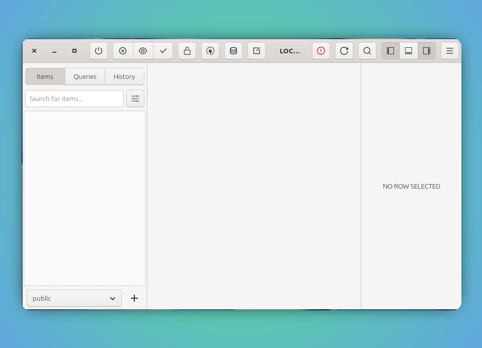
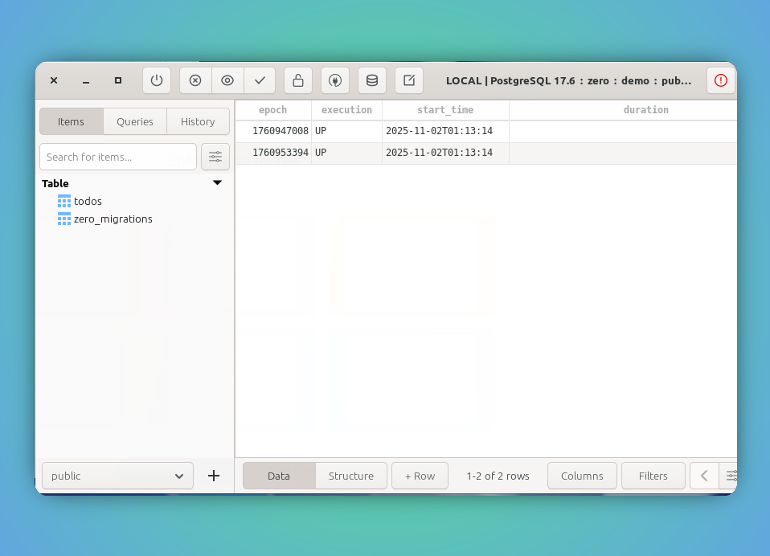

<style type="text/css">
  img-comparison-slider {
    --divider-width: 5px;
    --divider-color: #131212ff;
    --default-handle-opacity: 0.9;
  }
</style>

<script setup>
import { ImgComparisonSlider } from '@img-comparison-slider/vue';
</script>

# Migrations

Migrations are common pattern to add/alter the underlying the data model as the app evolves. 

Manual bookkeeping of these changes will be difficult tasks for developer and can be an error prone at times. 

To limit all such difficulty, `zero` framework comes with built-in solution of `migrations`.

To use `migrations` we need to follow three steps to get it achieved properly. 

1. Create migrate instance
2. Attach migrate instance to app.Migrations
3. Run migrations through `app.runMigrations()`. 

Thats all!

_`zero` 0.0.1 version only supports the manual addition of above steps, but there is a work happening to make this as automated process. Please bear with us to add them manually for sometime. Refer Feature parity for more_

Now, let us explore more on how to build a migrations for these statements and get them added to your app and skip them on consecutive executions.

```sql
CREATE TABLE IF NOT EXISTS todos (id SERIAL PRIMARY KEY, task TEXT NOT NULL, created_at TIMESTAMP NOT NULL DEFAULT CURRENT_TIMESTAMP );

INSERT INTO todos(task) values ('add migrations');

INSERT INTO todos(task) values ('verify migrations');
```

## 1. Migrate Instance

In order to do migration, the developer has to provide two information to add migrations to `zero` app exeuction.

Preparing needed DDL, DML and transaction commit are still limited with developer to provide `concise` and `executable` statements.

::: code-group
```zig [migrate instance]
const first_migration = &zero.migrate{
    .migrationNumber = 1760947008,
    .run = fn handler(c *zero.container) anyerror!void {
        # commands to execute
    }
};
```
:::

_In above steps, we are using the `epoch` timestamp as key_

## 2. Attach Migrate instance to App Migrations

Once the migrate instance created, we need to attach them to `zero` app migrations journey.

::: code-group
```zig [attach migrate instance]
// convert migrationNumber as string key
const key = try utils.toStringFromInt(allocator, "{d}", first_migration.migrationNumber);

// add to app migration
try app.addMigration(key, first_migration);
```
:::

## 3. Run Migrations

Now start running the migrations as needed in our app execution.

::: code-group
```zig [main.zig]
try app.runMigrations();
```
:::

## Example

1. Let us run `zero-migration` example to see them in action.

::: code-group
```zig [main.zig]
const std = @import("std");
const zero = @import("zero");
const ArenaAllocator = std.heap.ArenaAllocator;
const Allocator = std.mem.Allocator;

const App = zero.App;
const Context = zero.Context;
const migrate = zero.migrate;
const container = zero.container;
const utils = zero.utils;

pub const std_options: std.Options = .{
    .logFn = zero.logger.custom,
};

pub fn main() !void {
    var arean: ArenaAllocator = std.heap.ArenaAllocator.init(std.heap.page_allocator);
    defer arean.deinit();

    const allocator: Allocator = arean.allocator();

    const app: *App = try App.new(allocator);

    try prepareMigrations(app);

    try app.runMigrations();

    try app.run();
}

fn prepareMigrations(a: *App) !void {
    // 1. add todo table
    const addTodoMigration = &migrate{
        .migrationNumber = 1760947008,
        .run = addTodoTable,
    };

    const key = try utils.toStringFromInt(a.container.allocator, "{d}", addTodoMigration.migrationNumber);

    try a.addMigration(key, addTodoMigration);

    // 2. add todo entries
    const todoEntries = &migrate{
        .migrationNumber = 1760953394,
        .run = addTodoEntries,
    };

    const key2 = try utils.toStringFromInt(a.container.allocator, "{d}", todoEntries.migrationNumber);

    try a.addMigration(key2, todoEntries);
}

pub fn addTodoTable(c: *Context) anyerror!void {
    const addTodoTableQuery =
        \\ CREATE TABLE IF NOT EXISTS todos (id SERIAL PRIMARY KEY, task TEXT NOT NULL, created_at TIMESTAMP NOT NULL DEFAULT CURRENT_TIMESTAMP );
    ;
    _ = try c.SQL.exec(addTodoTableQuery, .{});
}

pub fn addTodoEntries(c: *Context) !void {
    const addTodoTableQuery =
        \\ INSERT INTO todos(task) values ('add migrations');
        \\ INSERT INTO todos(task) values ('verify migrations');
    ;
    _ = try c.SQL.exec(addTodoTableQuery, .{});
}
```

```bash [config/.env]
APP_ENV=dev
APP_NAME=zero-migration
APP_VERSION=1.0.0
LOG_LEVEL=debug

DB_HOST=localhost
DB_USER=user1
DB_PASSWORD=password1
DB_NAME=demo
DB_PORT=5432
DB_DIALECT=postgres
```
:::

2. Boom! Lets build and run our app, see if the migrations are all executed.

_🚩 The `zero` framework tracks all attached migrations in ascending order, and if any migrations were run previously, it will be automatically omitted on further run._

:::code-group
```bash [mirgations added]
❯ zig build migrations
 INFO [01:13:13] Loaded config from file: ./configs/.env
 INFO [01:13:13] config overriden ./configs/.dev.env file not found.
 INFO [01:13:14] generating database connection string for postgres
 INFO [01:13:14] connected to user1 user to demo database at 'localhost:5432'
 INFO [01:13:14] container is being created
 INFO [01:13:14] no authentication mode found and disabled.
 INFO [01:13:14] zero-migration app pid 11070
 INFO [01:13:14] 1760947008: migration completed  
 INFO [01:13:14] 1760953394: migration completed  
 INFO [01:13:14] registered static files from directory ./static
 INFO [01:13:14] Starting server on port: 8080
```
```bash [mirgations skipped]
❯ zig build migrations
 INFO [01:17:07] Loaded config from file: ./configs/.env
 INFO [01:17:07] config overriden ./configs/.dev.env file not found.
 INFO [01:17:08] generating database connection string for postgres
 INFO [01:17:08] connected to user1 user to demo database at 'localhost:5432'
DEBUG [01:17:08] redis is disabled, as redis host is not provided.
DEBUG [01:17:08] pubsub is disabled, as pubsub mode is not provided.
 INFO [01:17:08] container is being created
 INFO [01:17:08] no authentication mode found and disabled.
 INFO [01:17:08] zero-migration app pid 11937
DEBUG [01:17:08] 1760947008: migration is skipped  
DEBUG [01:17:08] 1760953394: migration is skipped  
 INFO [01:17:08] registered static files from directory ./static
 INFO [01:17:08] Starting server on port: 8080
```


## `zero_migrations` 🚨 

`zero` app tracks all the successfully ran migrations in this `zero_migrations` table with needed details.

If the entries are altered or removed from this table, the app execution will result in executing the migrations again and would corrupt the underlying data model.

`zero` framework trust the developers that they won't do anything with this table entries.

:::

<ImgComparisonSlider>
<!-- eslint-disable -->


<!-- eslint-enable -->
</ImgComparisonSlider>


## Recommendations

`zero` app tracks the migrations through an unique `key`, if the `keys` altered, the migration would eventually re-run, but that still in control of the developers.

`zero` recommends to use the `epoch` timestamp as key for all migrations. This simple command quickly gets you the `key value`

```bash
❯ date +%s
1660947353
```

## Recommendation

🚩 It is highly recommended to use the `ctx` allocator whenever possible, since it is tied up with request life-cycle, the de-allocation will be managed automatically and making sure the memory leak is not happening.