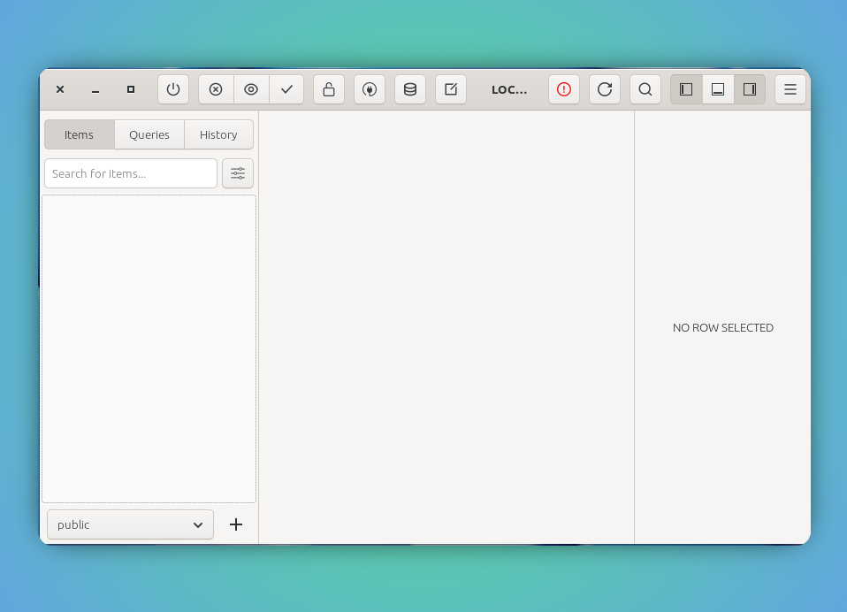
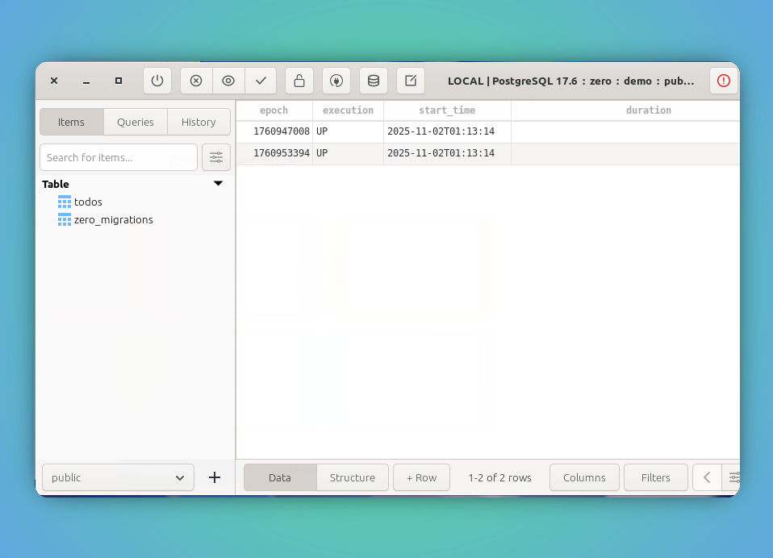

<script setup>
import { ImgComparisonSlider } from '@img-comparison-slider/vue';
</script>

# Migrations

Migrations are a common pattern for adding or changing your data model as the app evolves.

Tracking those changes by hand is tough and easy to get wrong.

To cut that pain, `zero` ships a built-in migrations solution.

`zero` now ships a CLI that **automates** migration creation and registration, so you no longer wire each one by hand.
You scaffold a migration, fill in the SQL, and `zero` wires it into your app and tracks it for you.

::: tip
A migration records itself in the `zero_migrations` table of **whatever backend it
targets**. `zero` supports two targets:

- **`relational`** — runs through `ctx.SQL`. Covers Postgres, SQLite, DuckDB,
  and ClickHouse.
- **`nosql`** — runs through `ctx.NoSQL` (CQL). Covers Cassandra, Couchbase, and
  MongoDB.

Relational migrations run inside a **database transaction**. If one fails, `zero`
rolls it back and leaves it **unrecorded**, so it is retried on the next run (it is
not silently masked as applied). NoSQL migrations have **no transaction** — CQL
offers none — so a failed NoSQL migration is simply left unrecorded and retried
next run. Only migrations that complete successfully are tracked and skipped
thereafter.
:::

## Automated migration creation

The migration workflow has three steps. Only the SQL is yours to write:

1. Build the `zero` CLI.
2. Scaffold a migration with `zero migrator add`.
3. Register all migrations in `main.zig` and run them.

### 1. Build the zero CLI

`zero` ships a small CLI to scaffold migrations. Building the framework also installs the CLI to a bin directory.
The default `zig build` step does this, or you can run `zig build zero` with a prefix explicitly.

```bash
zig build zero --prefix=/usr/local/bin
# -> ./usr/local/bin/zero
```

### 2. Scaffold a migration for your app

Run the `migrator add` subcommand with a `--name`. The name is sanitized
(`-` → `_`) and stamped with the current epoch as the `migrationNumber`.

```bash
cd app #zig app
zero migrator add --name create-users
```

This writes two things under `src/migrations/`:

- `create_users.zig` — the migration itself (edit the `TODO` SQL).
- `all.zig` — regenerated automatically; it registers **every** migration in
  `src/migrations/`. You never edit this file by hand.

The generated `create_users.zig` looks like:

::: code-group

```bash [command output]
❯ zero migrator add --name create-users
Created migration: src/migrations/create_users.zig (migrationNumber = 1760947008)
Updated: src/migrations/all.zig

# Make sure to invoke the all migrations.
try migrations.all(app);

# To run migrations add this line
try app.runMigrations();
```

```zig [src/migrations/create_users.zig]
const std = @import("std");
const zero = @import("zero");
const Context = zero.Context;
const migrate = zero.migrate;

pub const migrationNumber: i64 = 1760947008;

pub fn create_users_run(c: *Context) anyerror!void {
    const query =
        \\ -- TODO: write your migration SQL
    ;
    _ = try c.SQL.exec(c, query, .{});
}

pub const _migrate = &migrate{
    .migrationNumber = migrationNumber,
    .run = create_users_run,
    .target = .relational, // .relational (ctx.SQL) or .nosql (ctx.NoSQL)
};
```

:::

Edit the `TODO` line with your DDL/DML. Each migration's `run` executes inside a
transaction (for relational backends), so keep it concise and executable.

The `.target` field decides which handle the migration runs through. It defaults
to `.relational`; set it to `.nosql` to run CQL through `ctx.NoSQL` instead.

### SQL dialect support

The relational target adapts its DDL to the configured `DB_DIALECT`:

- **postgres** → Postgres DDL, with `$1,$2,...` binds and a
  `pg_advisory_lock` that serializes runs across replicas.
- **sqlite** / **duckdb** → SQLite-shaped DDL with `?` placeholders (DuckDB
  reuses SQLite's syntax here).
- **clickhouse** → `MergeTree` engine (`ENGINE = MergeTree() ORDER BY epoch`),
  because ClickHouse has no transactions and needs an explicit engine.

### NoSQL target example

For a wide-column store you set `.target = .nosql` and write CQL through
`ctx.NoSQL`. The migration records itself in a `zero_migrations` table it creates
for you.

::: code-group

```zig [src/migrations/create_users_nosql.zig]
const std = @import("std");
const zero = @import("zero");
const Context = zero.Context;
const migrate = zero.migrate;

pub const migrationNumber: i64 = 1760947008;

pub fn create_users_nosql_run(c: *Context) anyerror!void {
    // query() runs arbitrary CQL and returns the result as a JSON array.
    // Free it; migrations run on the app allocator, not the request allocator.
    const result = try c.NoSQL.query(c,
        \\ CREATE TABLE IF NOT EXISTS zero_migrations (
        \\   epoch bigint, execution text, start_time text, duration bigint,
        \\   PRIMARY KEY (epoch)
        \\ )
    );
    c.allocator.free(result);
}

pub const _migrate = &migrate{
    .migrationNumber = migrationNumber,
    .run = create_users_nosql_run,
    .target = .nosql,
};
```

:::

Because CQL has no transactions, a failed NoSQL migration is left unrecorded
rather than rolled back, and retried on the next run.

The regenerated `src/migrations/all.zig` collects every migration for you:

::: code-group

```zig [src/migrations/all.zig]
const std = @import("std");
const Self = @This();
const migrations = @This();
const zero = @import("zero");

const App = zero.App;
const migrate = zero.migrate;
const utils = zero.utils;

const create_users = @import("create_users.zig");

pub fn all(app: *App) !void {
    try app.addMigration(try Key(app, create_users._migrate), create_users._migrate);
}

fn Key(app: *App, m: *const migrate) ![]const u8 {
    return try utils.toStringFromInt(app.container.allocator, "{d}", m.migrationNumber);
}
```

:::

::: tip
Run `zero migrator add` again to add another migration. `all.zig` is regenerated
each time. Re-adding a name that already exists is rejected, so you can't clobber
an existing migration by accident.
:::

### 3. Register and run

In `main.zig`, import the generated migrations module and call `migrations.all(app)`
before `app.runMigrations()`. Order doesn't matter; `zero` sorts by
`migrationNumber` when it runs.

::: code-group

```zig [main.zig]
const std = @import("std");
const zero = @import("zero");

const App = zero.App;
const migrations = @import("migrations/all.zig");

pub const std_options: std.Options = .{
    .logFn = zero.logger.custom,
};

pub fn main(init: std.process.Init) !void {
    var gpa: std.heap.DebugAllocator(.{}) = .init;
    const allocator = gpa.allocator();
    _ = gpa.detectLeaks();

    const app: *App = try App.new(allocator, init.io, init.environ_map);

    migrations.all(app);
    try app.runMigrations();

    try app.run();
}
```

```bash [config/.env]
APP_ENV=dev
APP_NAME=zero-migration
APP_VERSION=1.0.0
LOG_LEVEL=debug

DB_HOST=localhost
DB_USER=user1
DB_PASSWORD=password1
DB_NAME=demo
DB_PORT=5432
DB_DIALECT=postgres
```

:::

Build and run. On the first run the migrations execute. On every later run they're skipped once recorded.

:::code-group

```bash [mirgations executed]
❯ zig build migrations
 INFO [01:13:13] Loaded config from file: ./configs/.env
 INFO [01:13:13] config overriden ./configs/.dev.env file not found.
 INFO [01:13:14] generating database connection string for postgres
 INFO [01:13:14] connected to user1 user to demo database at 'localhost:5432'
 INFO [01:13:14] container is being created
 INFO [01:13:14] no authentication mode found and disabled.
 INFO [01:13:14] zero-migration app pid 11070
 INFO [01:13:14] 1760947008: migration completed
 INFO [01:13:14] 1760953394: migration completed
 INFO [01:13:14] registered static files from directory ./static
 INFO [01:13:14] Starting server on port: 8080
```

```bash [mirgations skipped]
❯ zig build migrations
 INFO [01:17:07] Loaded config from file: ./configs/.env
 INFO [01:17:07] config overriden ./configs/.dev.env file not found.
 INFO [01:17:08] generating database connection string for postgres
 INFO [01:17:08] connected to user1 user to demo database at 'localhost:5432'
 INFO [01:17:08] container is being created
 INFO [01:17:08] no authentication mode found and disabled.
 INFO [01:17:08] zero-migration app pid 11937
 DEBUG [01:17:08] 1760947008: migration is skipped
 DEBUG [01:17:08] 1760953394: migration is skipped
 INFO [01:17:08] registered static files from directory ./static
 INFO [01:17:08] Starting server on port: 8080
```

:::

## `zero_migrations`

`zero` tracks every migration that ran successfully in the `zero_migrations` table, with the needed details.

If you alter or remove rows from this table, `zero` runs the migrations again and can corrupt your data model.

`zero` trusts you not to touch the rows in this table.

<ImgComparisonSlider>
<!-- eslint-disable -->


<!-- eslint-enable -->
</ImgComparisonSlider>

## Recommendations

`zero` tracks migrations by a unique `key`. If you change the `key`, the migration runs again, but that stays under your control.

`zero` recommends using the `epoch` timestamp as the `key` for every migration. This command prints the `key` value quickly:

```bash
❯ date +%s
1660947353
```

## Recommendation

Use the `ctx` allocator whenever you can. It's tied to the request life-cycle, so `zero` frees it for you and prevents memory leaks.
