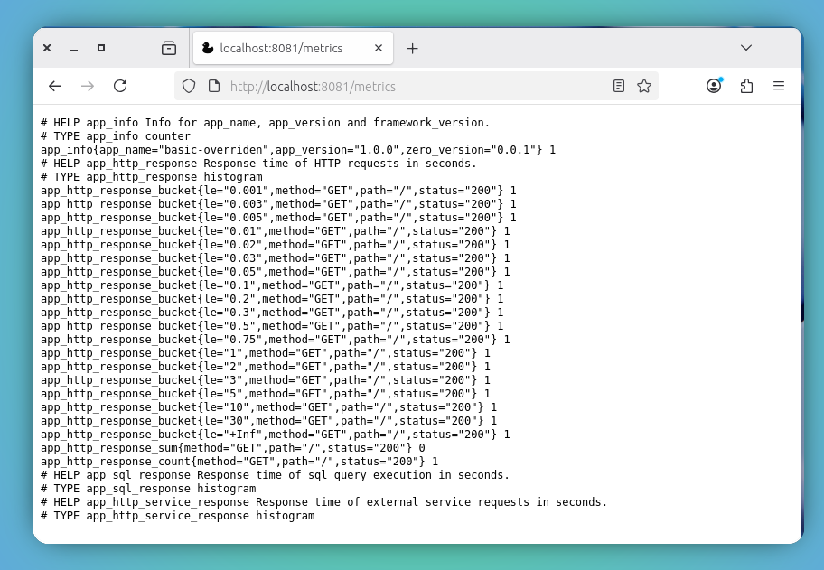
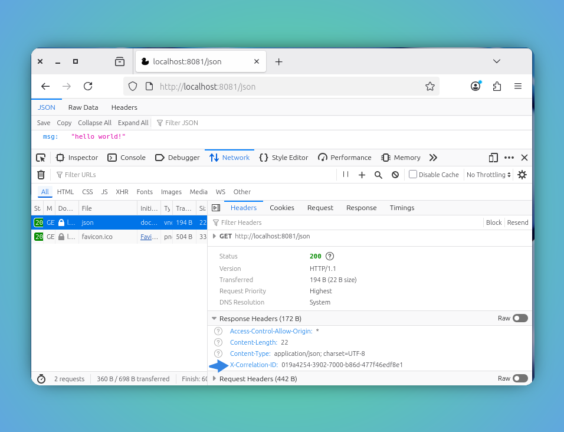

# Metrics

Though `LOG_LEVEL` gives visual
cue to understand the current status of the system, one can not keep scrolling through them all the time. There comes the `metrics` as handy.

`zero` exposes some default metrics to monitor the current state of the system in the `prometheus` format, which allows anyone can attach it to `prometheus` scrapper and preview the state in `Grafana` dashboards.

As this becomes industry standard, `zero` framework follows the same path to exhibit some basic and needed metris.

The metrics are accessible through `/metrics` endpoint and that kept outside of the authentication route.

Following list of metrics value available

| metric_name               |  Export   |                                               Description |
| :------------------------ | :-------: | --------------------------------------------------------: |
| app_info                  |   gauge   |                             The app and framework version |
| app_http_response         | histogram |                         The response status and latencies |
| app_sql_response          | histogram |                    The query type and execution latencies |
| app_http_service_response | histogram | The request status and latencies of the external services |

## Tracing

`zero` app by default injects a trace id for all your incoming requests and allows to propogate to execute your own logic.

The trace id is injected as `x-correlation-id`, with that we can gain more insights on how the requests are carry forwarded across multiple services and address if there is any bottleneck encountered.

**NOTE**

The tracing capability is limited and basic in `zero` app `0.0.1` version. The target to integrate OpenTelemetry depends on other factors.

