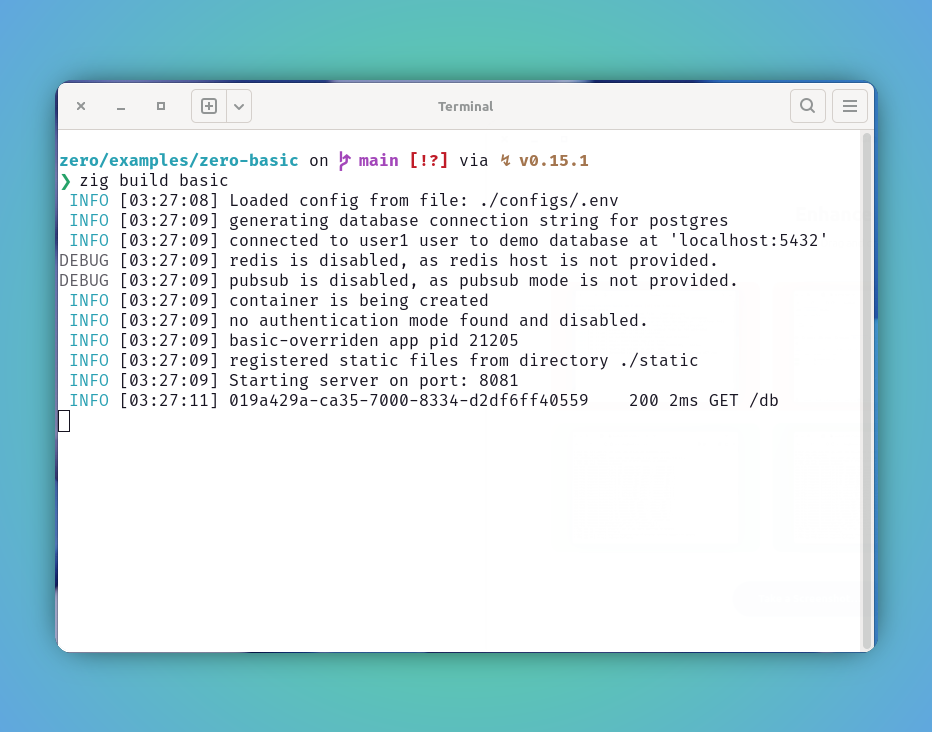
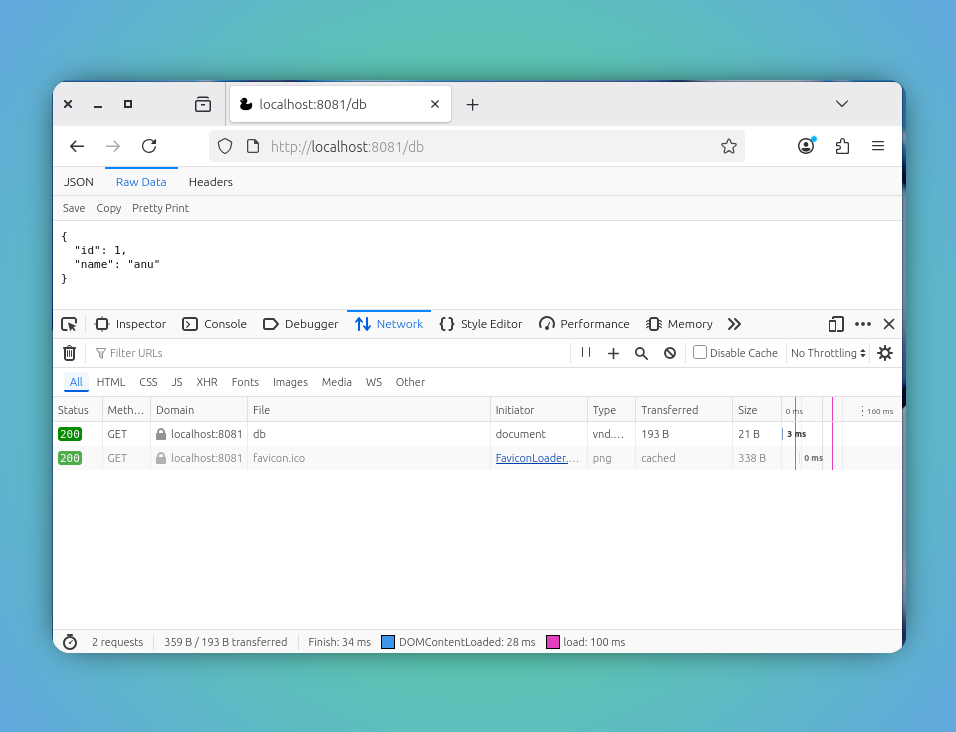

<style type="text/css">
  img-comparison-slider {
    --divider-width: 5px;
    --divider-color: #131212ff;
    --default-handle-opacity: 0.9;
  }
</style>

<script setup>
import { ImgComparisonSlider } from '@img-comparison-slider/vue';
</script>

# Postgres

`zero` has built-in support for the accessing the postgres database.

```bash
ctx.SQL.queryRow(); #retrieves one row at a time

ctx.SQL.queryRows(); #retrieve multiple rows at a time

ctx.SQL.exec(); #execute any statements that persist the data

ctx.SQL.select(comptime T: type) #retrieve and transform data to any known comptime T

ctx.SQL.selectSlice(comptime T: type) #retrieve and transform one or more data to any known comptime T
```

With above mentioned method, the databse calls are abstracted, and leveraged through handler `Context` and achieves the desired results without any boiler-plate.

Typically we use the underlying database to perform the actions based on the app REST handlers, that can be attached and get the CRUD operation done.

## REST Handlers

This example demonstrates the first step to spin up the `zero-basic` web app using the `zero` framework. As we are going to connect to database and retrieve needed database container as follows:

1. Pull and run podman or docker container.

::: code-group
```bash [postgres container]
❯ podman pull docker.io/library/postgres:17-alpine3.21
❯ podman run -d --name pg17 -e POSTGRES_USER=user1 -e POSTGRES_PASSWORD=password1 -v podman:/var/lib/postgresql/data -p 5432:5432 postgres:17-alpine3.21
```
:::

2. Create new database and tables.

::: code-group
```sql [SQL Schema]
CREATE DATABASE demo;

CREATE TABLE users(
 id SERIAL PRIMARY KEY,
 name VARCHAR(100)
);

INSERT INTO users(name) values ('anu');
```
:::

_Please bear with this step to try out things manually in database this one time._

_But `zero` framework provides option to automate and add migrations/data systematically. More on [Migrations](./migrations.md)_

3. Let us update our basic app configurations `configs/.env` with this.


::: code-group
```bash [configs/.env]
# App configs
APP_ENV=dev #zero framework tries to override .dev.env if it availables
APP_NAME=basic
APP_VERSION=1.0.0
LOG_LEVEL=info #default level of zero framwork
HTTP_PORT=8080 #default port of zero framwork

# Database configs
DB_HOST=localhost
DB_USER=user1
DB_PASSWORD=password1
DB_NAME=demo
DB_PORT=5432
DB_DIALECT=postgres
```
:::

4. Refer following simple `GET` rest handler to retrieve our data from database.

::: code-group
```zig [main.zig]
const std = @import("std");
const zero = @import("zero");

const App = zero.App;
const Context = zero.Context;

pub const std_options: std.Options = .{
    .logFn = zero.logger.custom,
};

pub fn main() !void {
    var arean = std.heap.ArenaAllocator.init(std.heap.page_allocator);
    defer arean.deinit();

    const allocator = arean.allocator();

    const app = try App.new(allocator);

    try app.get("/db", dbResponse);

    try app.run();
}

pub fn dbResponse(ctx: *Context) !void {
    const User = struct {
        id: i32,
        name: []const u8,
    };

    var row = try ctx.SQL.queryRow("select id, name from users limit 1", .{}) orelse unreachable;
    defer row.deinit() catch {};

    const user = try row.to(User, .{});

    try ctx.json(user);
}
```
:::

4. Boom! Lets build and run our app.

```bash
zero/examples/zero-basic on main via ↯ v0.15.1 
❯
❯ zig build basic
 INFO [03:27:08] Loaded config from file: ./configs/.env
 INFO [03:27:09] generating database connection string for postgres
 INFO [03:27:09] connected to user1 user to demo database at 'localhost:5432'
DEBUG [03:27:09] redis is disabled, as redis host is not provided.
DEBUG [03:27:09] pubsub is disabled, as pubsub mode is not provided.
 INFO [03:27:09] container is being created
 INFO [03:27:09] no authentication mode found and disabled.
 INFO [03:27:09] basic-overriden app pid 21205
 INFO [03:27:09] registered static files from directory ./static
 INFO [03:27:09] Starting server on port: 8081
 INFO [03:27:11] 019a429a-ca35-7000-8334-d2df6ff40559	 200 2ms GET /db

```

5. Preview server status and handler response.

<ImgComparisonSlider>
<!-- eslint-disable -->


<!-- eslint-enable -->
</ImgComparisonSlider>

_Make use of this image slider to glide between status and response_

In this demo, we successully created database, added basic information, connected from zero framework app and retrieved the data as intented. This is just a beginning, we can do more and explained in [HTMX](./htmx-crud.md) example.

## Recommendation

🚩 It is highly recommended to use the `ctx` allocator whenever possible, since it is tied up with request life-cycle, the de-allocation will be managed automatically and making sure the memory leak is not happening.