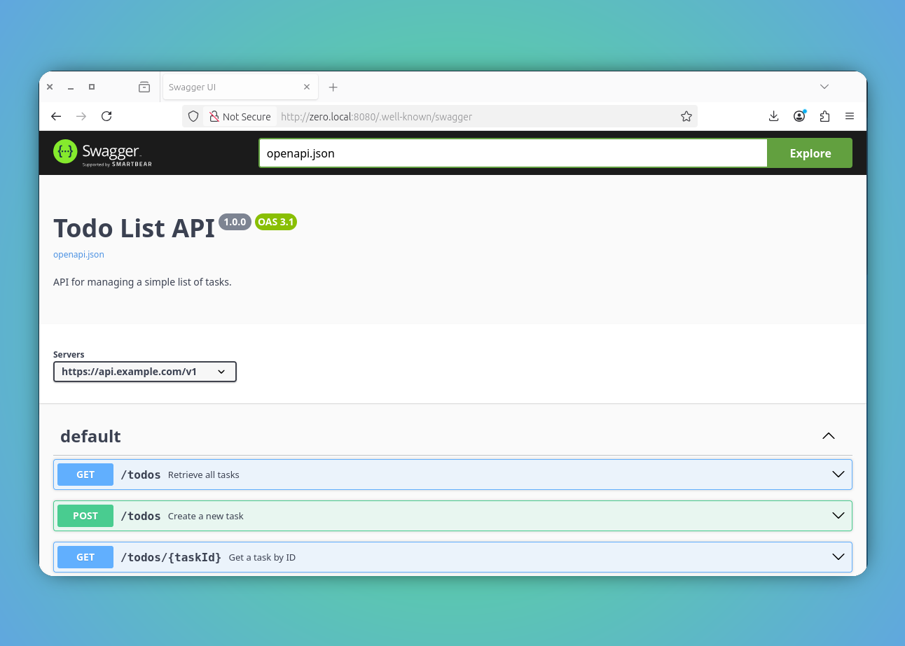

# Render API Specifications

`zero` framework offers built-in support to preview the underlying API specifications using the well-known path.

In order to preview, one has to put the `openapi.json` specification file under the `static` directory and access following link to see them in action.

::: code-group
```bash [swagger url]
http://zero.local:8080/.well-known/swagger
```

:::


## Example

1. Refer following `zero-todo-htmx` example further to know more on getting started of this.


