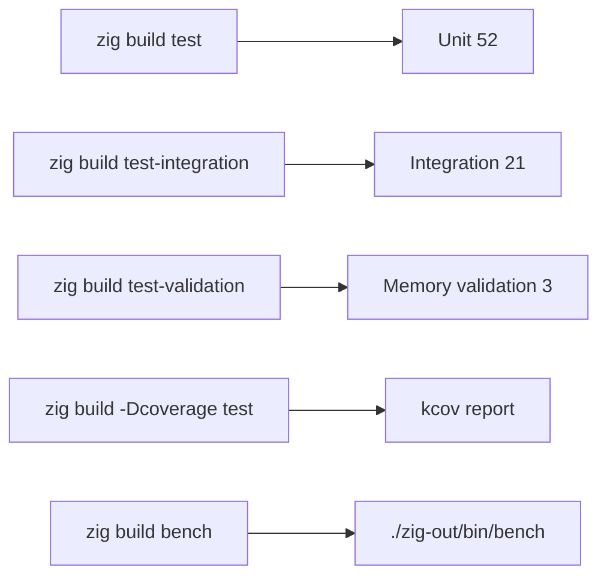

# Testing

`zero` ships a layered test and benchmark suite so the framework itself can be
verified and load-tested. These commands run against the `zero` repository (not
your application) — use them when contributing to or validating a build of the
framework.



## Test layers

### Unit tests

`zig build test` builds `src/tests.zig` (the test root) and runs every inline
`test` block across the source tree. On the `experimental` (0.16) branch the
suite compiles and runs; the framework README reports **94/94** tests across the
layers for 0.16.0.

```bash
zig build test
```

### Integration tests

`zig build test-integration` exercises the real datasource path against
`SQLite :memory:` and (when configured) Postgres — 21 tests in
`src/tests_integration.zig`. These need a native driver, so they are a separate
step and are excluded from the kcov coverage run (the native driver aborts under
ptrace).

```bash
zig build test-integration
```

### Memory-validation tests

`zig build test-validation` proves that allocations made under `zero.Context`
are released per request, per cron tick, and per pub/sub message. It uses a
counting allocator and covers the `timestampz` invalid-free fix — 3 tests in
`src/tests_validation.zig` / `src/validation/memory_test.zig`.

```bash
zig build test-validation
```

### Coverage

`zig build -Dcoverage test` runs the unit tests under **kcov** and writes an
HTML report to `zig-out/kcov/` (scoped to `src/`). Measured at **87.91%**.

```bash
zig build -Dcoverage test
```

## How the tests are organized

- Each source file carries its own inline `test` blocks (the Zig convention).
- `src/tests.zig` is the **test root**: it imports every module and references
  them in a `comptime { _ = module; }` block, so `zig build test` picks up all
  inline tests automatically.
- `build.zig` constructs a dedicated test module (`test_module`) whose root is
  `src/tests.zig`, with the same dependency imports as the library module
  (pgz, httpz, zul, okredis, sqlite, nats, protobuf, graphql, …).

## Known leak caveat

The unit run uses `std.testing.allocator` (DebugAllocator). Some paths leak
memory (7 known leaks), so the build **exits non-zero** even though every
assertion passes. This is a known issue, not a logic bug — assertions are still
trustworthy. When writing tests, allocate via `std.testing.allocator` and accept
the leak warnings for known cases.

## Benchmark harness

`zig build bench` builds a standalone HTTP load generator at `./zig-out/bin/bench`.
It boots the real `zero.App`, drives it with the `zul` HTTP client across a
concurrency ramp, and reports throughput plus latency percentiles — no
third-party load tool required.

```bash
zig build bench                                  # builds ./zig-out/bin/bench
./zig-out/bin/bench                              # default: /.well-known/health, 3s/level, ramp 1..1000
./zig-out/bin/bench --duration=3 --levels=1,50,200,500,1000
./zig-out/bin/bench --path=/your/route --duration=5 --levels=10,100,500
./zig-out/bin/bench --log                         # leave framework logging on
```

| flag | default | meaning |
| --- | --- | --- |
| `--duration=N` | `3` | seconds to hammer each concurrency level |
| `--levels=csv` | `1,10,50,100,200,500,1000` | concurrency levels (worker counts) |
| `--path=` | `/.well-known/health` | target path on `http://127.0.0.1:<HTTP_PORT>` |
| `--log` | off | keep framework logs on (off silences them) |

Run the binary directly (`./zig-out/bin/bench`), **not** `zig build run bench` —
the bench harness uses `pub fn main(init: std.process.Init)` and the `--listen=-`
stdout protocol would interfere. Output columns: throughput (req/s), latency
percentiles (µs), error count, resident set size per level (`rss`), and RSS growth
(`dRss`) which is the leak signal. The liveness endpoint is `/.well-known/health`
(not `/health`, which returns 404 by design).

## Prerequisites & housekeeping

- **`librdkafka`** is linked as a weak system library — Kafka tests fail to build
  without `apt install librdkafka-dev` / `brew install librdkafka`.
- For integration tests, point `DB_*` config at a reachable Postgres (SQLite uses
  `:memory:` and needs no service).
- Always clear caches before switching Zig versions: `make clean` removes
  `.zig-cache`, `zig-out`, `zig-pkg/` and every example's build artifacts.
- Release build: `zig build --release=fast`.
