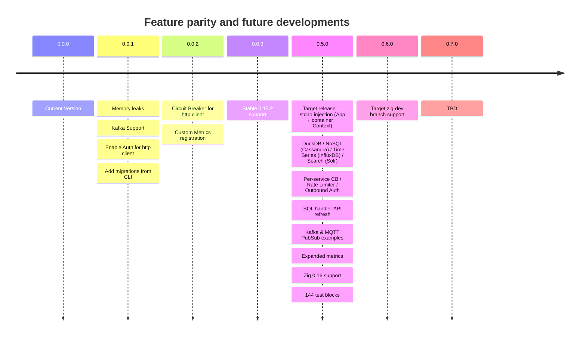

# Roadmap

```mermaid
---
config:
  logLevel: 'debug'
---
    timeline
        title Feature parity and future developments
            0.0.0 : Current Version
            0.0.1 : Memory leaks : Kafka Support : Enable Auth for http client : Add migrations from CLI
            0.0.2 : Circuit Breaker for http client : Custom Metrics registration
            0.0.3 : Stable 0.15.2 support
            0.5.0 : Target release — std.Io injection (App → container → Context) : DuckDB / NoSQL (Cassandra) / Time Series (InfluxDB) / Search (Solr) : Per-service CB / Rate Limiter / Outbound Auth : SQL handler API refresh : Kafka & MQTT PubSub examples : Expanded metrics : Zig 0.16 support : 144 test blocks
            0.6.0 : Target zig-dev branch support
            0.7.0 : TBD

```
