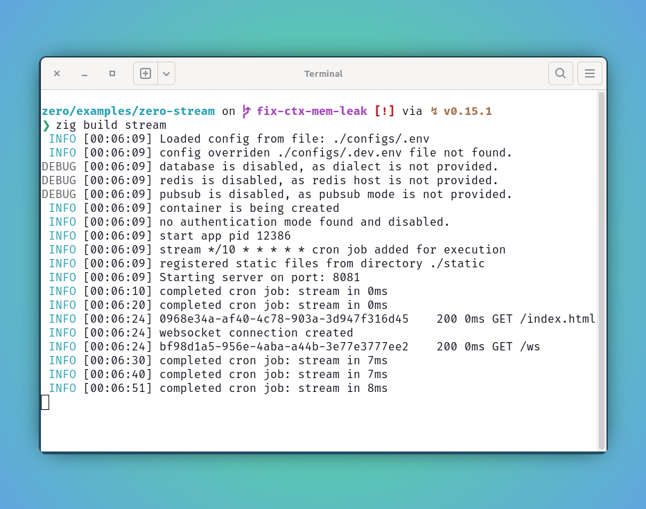
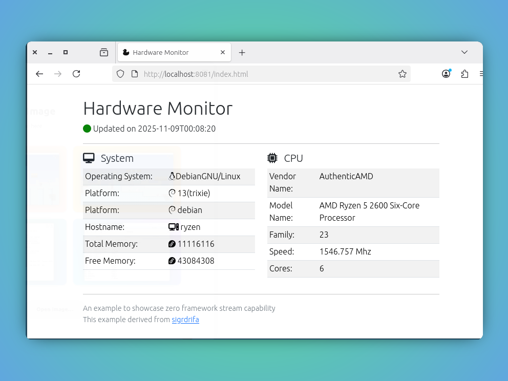

<script setup>
import { ImgComparisonSlider } from '@img-comparison-slider/vue';
</script>


# Websocket

`zero` offers built-in support for persistent, bi-directional, low-latency TCP connections. These stream data to and from clients. This makes real-time communication straightforward.

::: code-group
```zig [method signature]
try app.addWebsocket(connect);
```

```zig [register-connection]
pub fn connect(ctx: *Context) !void {
    try connections.put(ctx.request.header("sec-websocket-key").?, ctx.wsClient);
}
```

```zig [stream contents]
try ctx.wsClient.write("hello!");
```
:::


### Using in zero

1. See the `zero-stream` example below for a full getting-started walkthrough.

::: code-group
```zig [main.zig]
pub fn main(init: std.process.Init) !void {
    var arean = std.heap.ArenaAllocator.init(std.heap.page_allocator);
    defer arean.deinit();
    const allocator = arean.allocator();

    const app = try App.new(allocator, init.io, init.environ_map);

    connections = std.hash_map.StringHashMap(?*zero.WSClient).init(allocator);

    try app.addWebsocket(connect);

    try app.addCronJob("*/10 * * * * *", "stream", stream);

    try app.run();
}

pub fn connect(ctx: *Context) !void {
    mutex.lock();
    defer mutex.unlock();
    try connections.put(ctx.request.header("sec-websocket-key").?, ctx.wsClient);
}

pub fn stream(ctx: *Context) !void {
    var iterator = connections.iterator();
    while (iterator.next()) |e| {
        const conn = e.value_ptr.*;
        if (conn == null) {
            ctx.info("connection is null");
            continue;
        }

        const c = conn.?;

        if (c._closed) {
            ctx.info("connection is closed");
            return;
        }

        var sb = Builder.init(ctx.allocator);
        defer sb.deinit();

        const timestamp = try utils.sqlTimestampz(ctx.allocator);

        try sb.write("<div hx-swap-oob=\"innerHTML:#update-timestamp\">");
        try sb.write("<p><i style='color: green' class='fa fa-circle'></i>");
        try sb.write("Updated on");
        try sb.write(timestamp);
        try sb.write("</p></div>");
        try sb.write("<div hx-swap-oob=\"innerHTML:#system-data\">");
        try getHostInfo(ctx, &sb);
        try sb.write("</div>");
        try sb.write("<div hx-swap-oob=\"innerHTML:#cpu-data\">");
        try getCPUInfo(ctx, &sb);
        try sb.write("</div>");

        try c.write(sb.string());
    }
}

```
_Read the full example to see how it all fits together._
:::

2. Let's build and run the app.


```bash
zero/examples/zero-stream on  main [✘!?] via ↯ v0.15.1 
❯ zig build stream
 INFO [00:11:20] Loaded config from file: ./configs/.env
 INFO [00:11:20] config overriden ./configs/.dev.env file not found.
DEBUG [00:11:20] database is disabled, as dialect is not provided.
DEBUG [00:11:20] redis is disabled, as redis host is not provided.
DEBUG [00:11:20] pubsub is disabled, as pubsub mode is not provided.
 INFO [00:11:20] container is being created
 INFO [00:11:20] no authentication mode found and disabled.
 INFO [00:11:20] start app pid 13554
 INFO [00:11:20] stream */10 * * * * * cron job added for execution
 INFO [00:11:20] registered static files from directory ./static
 INFO [00:11:20] Starting server on port: 8081
 INFO [00:11:21] websocket connection created
 INFO [00:11:21] 3d34c1cc-8def-4d53-99bc-c9a4d7e18e2b	 200 0ms GET /ws
 INFO [00:11:30] completed cron job: stream in 7ms
 INFO [00:11:40] completed cron job: stream in 7ms
 INFO [00:11:50] completed cron job: stream in 7ms
 INFO [00:12:00] completed cron job: stream in 7ms
 INFO [00:12:10] completed cron job: stream in 3ms
 INFO [00:12:20] completed cron job: stream in 7ms
 INFO [00:12:30] completed cron job: stream in 7ms
 INFO [00:12:40] completed cron job: stream in 8ms
 INFO [00:12:50] completed cron job: stream in 7ms
```

3. Preview the server status and the streaming hardware monitor.

<ImgComparisonSlider>
<!-- eslint-disable -->


<!-- eslint-enable -->
</ImgComparisonSlider>

