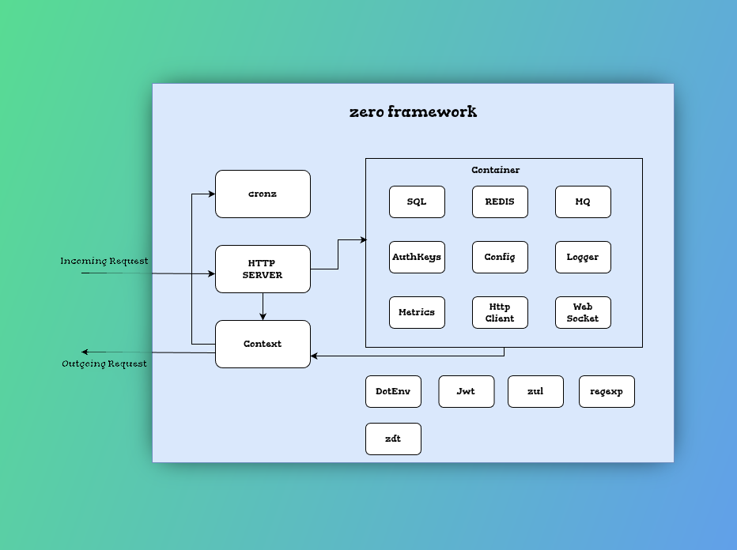
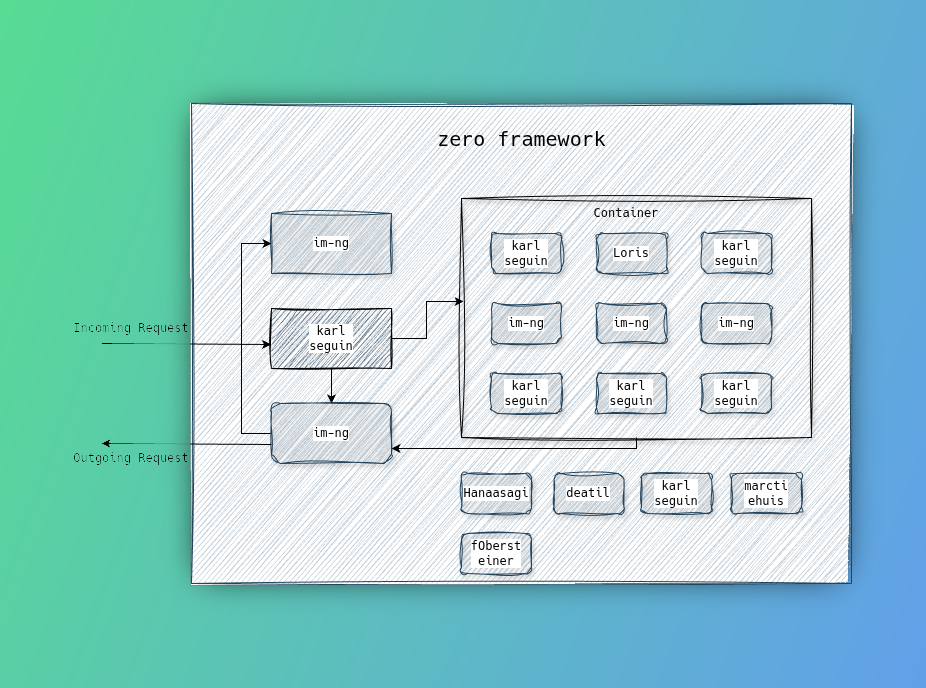

# Module Attribution

<ImgComparisonSlider>
<!-- eslint-disable -->

<!-- eslint-enable -->
</ImgComparisonSlider>

_Use this image slider to switch between the module's underlying author and framework building elements. This seemed like a fun and great way to at least honor them._